In this exercise, you will use the Azure Portal to create a Stream Analytics job and connect it to the IoT hub you created in the previous lab.

1. Open the [Azure Portal](https://portal.azure.com) in your browser. If asked to log in, do so using your Microsoft account.

1. Click **+ Create a resource**, followed by **Internet of Things** and **Stream Analytics job**.

    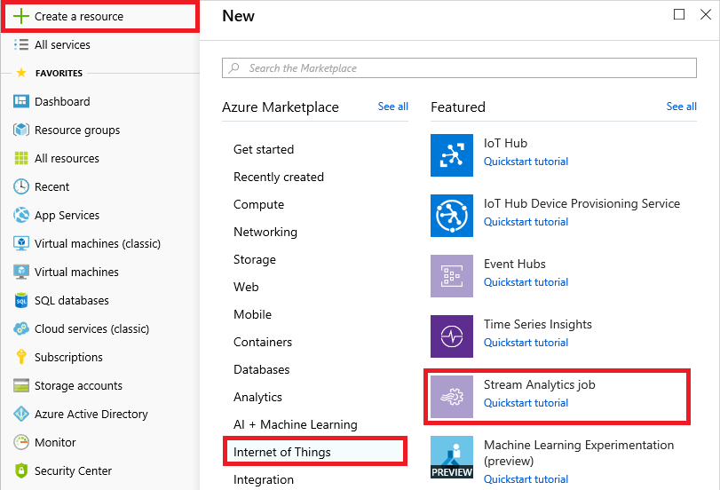

    _Creating a Stream Analytics job_

1. Name the job "polar-bear-analytics" and place it in the "streaminglab-rg" resource group that you created in the previous lab. Specify **South Central US** as the location. (That's important, because your IoT hub is in the same region, and while you are not charged for data that moves within a data center, you typically *are* charged for data that moves *between* data centers. In addition, locating services that are connected to each other in the same region reduces latency.) Make sure **Hosting environment** is set to **Cloud**, and set **Streaming units** to 1. Then click the **Create** button.

    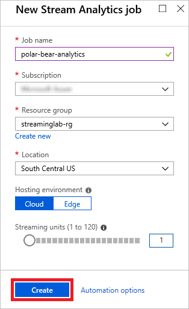

    _Specifying parameters for the Stream Analytics job_

1. Open the "streaminglab-rg" resource group and click **polar-bear-analytics** to open the Stream Analytics job in the portal. If the Stream Analytics job doesn't appear in the resource group, click the **Refresh** button at the top of the blade until it does.

1. Click **Inputs** in the menu on the left side of the blade. Then click **Add stream input** and select **IoT Hub** to add an input to the Stream Analytics job.

    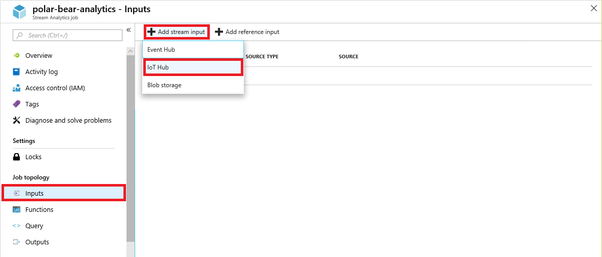

    _Adding an input_

1. Type "CameraInput" into the **Input alias** box. Select the IoT hub that you created in the previous lab, make sure **Endpoint** is set to **Messaging**, and accept the defaults everywhere else. Then click the **Save** button at the bottom of the blade.

    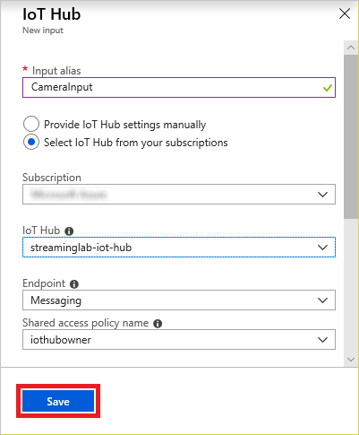

    _Creating an input_

After a few moments, the new input — "CameraInput" — appears in the list of inputs for the Stream Analytics job. This is the only input you will create, but be aware that you can add any number of inputs to a Stream Analytics job. In the [Stream Analytics Query Language](https://msdn.microsoft.com/library/azure/dn834998.aspx), each input is treated as a separate data source similar to tables in a relational database. The query language is extremely expressive, even allowing input streams to be joined in a manner similar to joining database tables.

The heart of a Stream Analytics job is the query that extracts information from the data stream. It is always advisable to test a query using sample data before deploying it against a live data stream, because with sample data, you can verify that a known set of inputs produces the expected outputs.

1. Return to the Stream Analytics job in the portal and click **Query** in the menu on the left side of the blade. Then click the **ellipsis** (the three dots) to the right of **CameraInput** and select **Upload sample data from file** from the menu.

    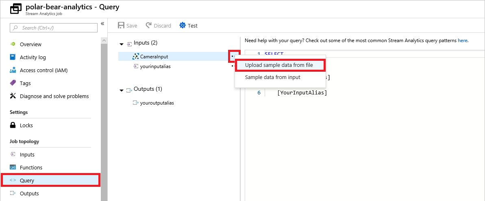

    _Uploading sample data_

1. Click the **folder** icon on the right and select the file named **sample-data.json** from the resources included with this lab. Then click **OK** to upload the file.

    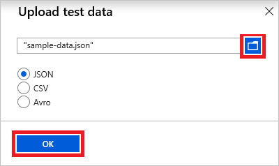

    _Uploading sample-data.json_

1. When the upload is complete, type the following query into the query window. Then click the **Test** button to execute it:

	```sql
	SELECT * FROM CameraInput
	```

	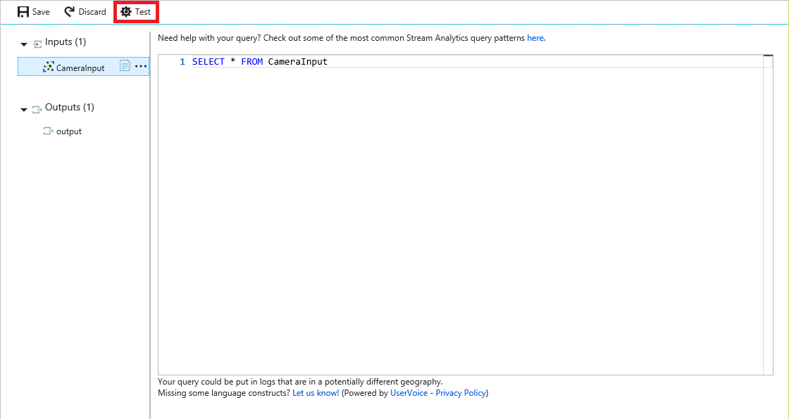

	_Testing a query_

1. Confirm that you see the output pictured below. The test data contains 50 rows, each representing an event transmitted to the IoT hub by one of the cameras in the camera array. DEVICEID is the camera's device ID, LATITUDE and LATITUDE specify the camera's location, URL is the URL of the blob containing the picture that was taken, and TIMESTAMP is the time at which the picture was taken. The other fields were added by Azure.

	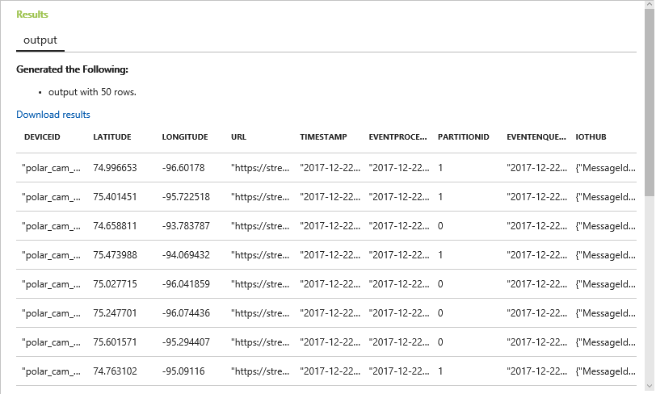

	_Query result_

1. One of the key features of the Stream Analytics Query Language is its ability to group results using windows of time whose length you specify. Windowing is enacted using the keywords [TumblingWindow](https://msdn.microsoft.com/azure/stream-analytics/reference/tumbling-window-azure-stream-analytics), [HoppingWindow](https://msdn.microsoft.com/azure/stream-analytics/reference/hopping-window-azure-stream-analytics), [SlidingWindow](https://msdn.microsoft.com/azure/stream-analytics/reference/sliding-window-azure-stream-analytics), and [SessionWindow](https://msdn.microsoft.com/en-us/azure/stream-analytics/reference/session-window-azure-stream-analytics) in a GROUP BY clause. To demonstrate, execute the following query to count the number of times the cameras were triggered each minute:

	```sql
	SELECT System.Timestamp as [Time Ending],
	    COUNT(*) AS [Times Triggered]
	FROM CameraInput TIMESTAMP BY timestamp
	GROUP BY TumblingWindow(n, 1)
	```
	> [TIMESTAMP BY](https://msdn.microsoft.com/library/azure/mt573293.aspx) is an important element of the Stream Analytics Query Language. If it was omitted from the query above, you would be querying for the number of events that arrived *at the event hub* each minute rather than the number of events that occurred at the camera locations. TIMESTAMP BY allows you to specify a field in the input stream as the event time.

1. Confirm that you see the output below:

	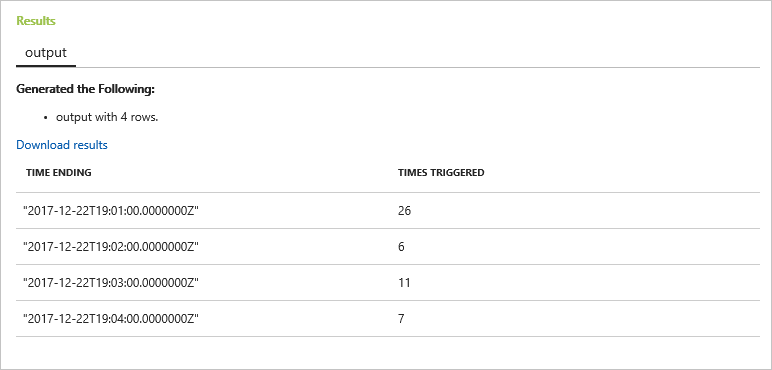

	_Query result using TumblingWindow_

1. Now it's time to check for two photos snapped by the same camera within 10 seconds. *This is the query that you will use against a live data stream*. The assumption is that since polar bears tend to move rather slowly, we will ignore pictures taken more than 10 seconds apart, but if the same camera snaps two pictures within 10 seconds, it is worth examining them to see if one of them contains a polar bear.

	Enter the following query and click **Test** to execute it:

	```sql
	SELECT C1.deviceId, C1.latitude, C1.longitude, C1.url, C1.timestamp
	FROM CameraInput C1 TIMESTAMP BY timestamp
	JOIN CameraInput C2 TIMESTAMP BY timestamp
	ON C1.deviceId = C2.deviceId
	AND DATEDIFF(ss, C1, C2) BETWEEN 0 AND 10
	AND C1.timestamp != C2.timestamp
	```

1. This time the output should contain six rows, each representing two photographs taken by the same camera within 10 seconds and containing the URL of one of the pictures.

	> If you wanted to include *both* URLs in the output, how would you modify the query to do it?

	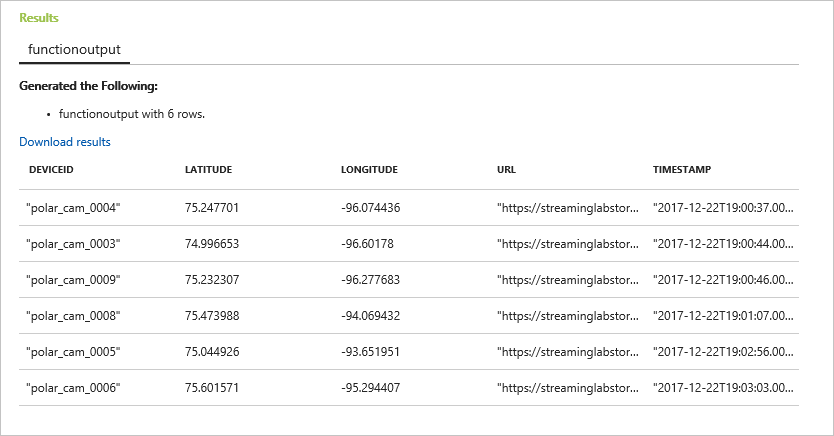

	_Cameras that snapped two pictures within 10 seconds_

Finish up by clicking the **Save** button at the top of the blade to save the query. Then click **Yes** when asked to confirm. This will be the query that's executed when you run the Stream Analytics job.

The query that you tested in the previous exercise employs simple logic: if the same camera snaps two pictures within 10 seconds, there *might* be a polar bear. But the ultimate goal is to determine with a great deal of confidence whether there really *is* a polar bear. That means supplementing Stream Analytics with machine learning.

One way to connect a Stream Analytics job to a machine-learning model running in the cloud is to use an [Azure Function](https://azure.microsoft.com/services/functions/) as a Stream Analytics output. The function, which is invoked each time Stream Analytics produces an output, can then call out to the machine-learning model.

1. In the Azure Portal, click **+ Create a resource**, followed by **Compute** and **Function App**.

    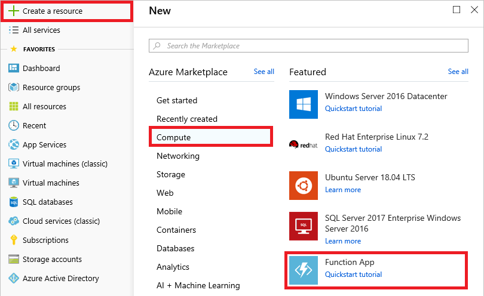

    _Creating an Azure Function App_

1. Enter an app name that is unique to Azure. Place the Function App in the "streaminglab-rg" resource group and set **Hosting Plan** to **App Service Plan**. Then click **App Service plan/Location** and create a new App Service plan in the South Central US region. Select **JavaScript** as the **Runtime Stack**. Under **Storage**, select the storage account that you created in the previous lab. Finally, turn **Application Insights** off and click the **Create** button to create a new Azure Function app.

	> When you create an Azure Function App, you can choose from two hosting plans: Consumption plan or App Service plan. The former is cheaper because you only pay when the function executes. But with Consumption plan, the function might not execute for several minutes after it's called. With App Service plan, you pay more, but the function runs immediately.
 
    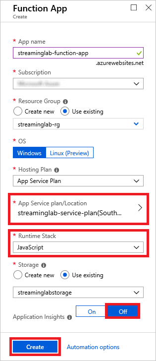

    _Creating an Azure Function App_

1. Open the "streaminglab-rg" resource group in the portal and click **Refresh** until the Function App appears. Click the Function App, and then click **Platform features** followed by **SSL**.

	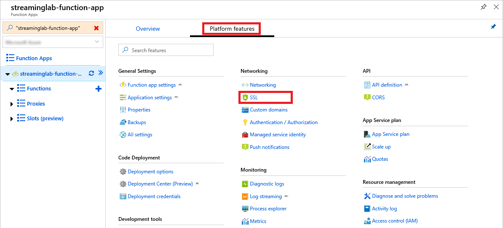

	_Opening SSL settings for the Function App_

1. Under "Protocol Settings," make sure the minimum TLS version is set to 1.0.

	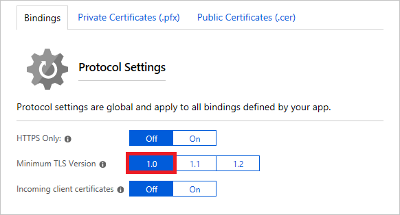

	_Setting the minimum TLS version_

1. Click the **+** sign to the right of **Functions**. Click **In-portal**, and then click **Continue**.

    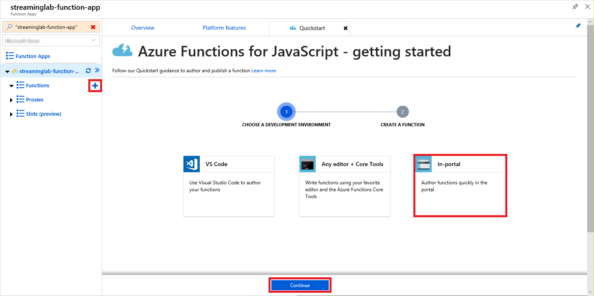

    _Adding a function_

1. Click **Webhook + API**, and then click **Create**.

    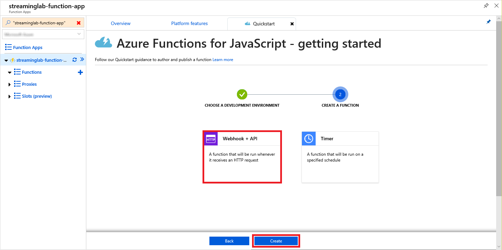

    _Adding a Webhook function_

1. Replace the code shown in the code editor with the statements below. Then click **Save**, followed by **Run**.

	```javascript
	module.exports = async function (context, req) {
	    context.log(req.rawBody);
	};
	```

	

	_Saving and running the function_

1. Return to the Stream Analytics job in the portal and click **Outputs** in the menu on the left side of the blade. Click **+ Add** and select **Azure function** to add an Azure Function as an output.

	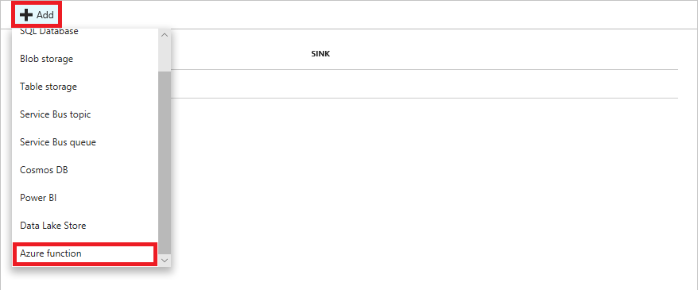

	_Adding an output_

1. Name the output "FunctionOutput." Select the Function App you created earlier in this exercise and accept the defaults everywhere else. Then click **Save**.

	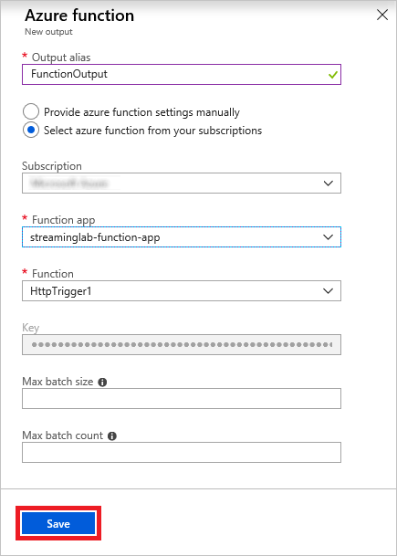

	_Creating an output_

	Just as a Stream Analytics job will accept multiple inputs, it supports multiple outputs, too. In addition to passing the output to an Azure Function, you could easily add outputs to log the output from the job in an Azure SQL database, a Cosmos DB database, blob storage, and other locations.

1. Wait for the output to appear in the list of outputs, indicating that it has been successfully added to the Stream Analytics job. Then modify the query you wrote in the previous exercise to include an ```INTO``` clause (line 2 below) that directs query results to the output you just added:

	```sql
	SELECT C1.deviceId, C1.latitude, C1.longitude, C1.url, C1.timestamp
	INTO FunctionOutput
	FROM CameraInput C1 TIMESTAMP BY timestamp
	JOIN CameraInput C2 TIMESTAMP BY timestamp
	ON C1.deviceId = C2.deviceId
	AND DATEDIFF(ss, C1, C2) BETWEEN 0 AND 10
	AND C1.timestamp != C2.timestamp
	```

	Click **Save** to save the query.

1. Click **Overview** in the menu on the left and click **Start** to start the Stream Analytics job running.

    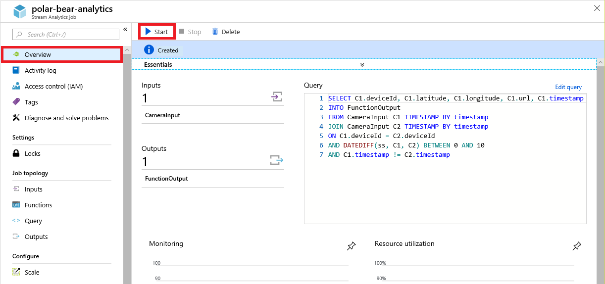

    _Starting the Stream Analytics job_

1. Make sure **Job output start time** is set to **Now**, and then click **Start** to start the run.

    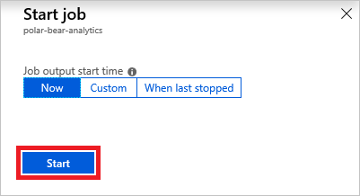

    _Specifying the job start time_

The job will take a couple of minutes to start, but you don't have to wait. Proceed to the next exercise and start generating events for Stream Analytics to ingest.

1. Return to the project directory that you created in the previous lab and create a file in it named **run.js**. Paste the following code into the file:

	```javascript
	'use strict';

	var iotHubName = 'HUB_NAME';
	var storageAccountName = 'ACCOUNT_NAME';
	var storageAccountKey = 'ACCOUNT_KEY';
	
	class Camera {
	    constructor(id, latitude, longitude, key, files) {
	        this._id = id;
	        this._latitude = latitude;
	        this._longitude = longitude;
	        this._key = key;
	        this._files = files.slice(0);
	        this._ready = false;
	    }
	
	    get id() {
	        return this._id;
	    }
	
	    connect(iotHubName, storageAccountName, storageAccountKey, callback) {
	        // Connect to blob storage
	        var azure = require('azure-storage');
	        this._storageAccountName = storageAccountName;
	        this._blobService = azure.createBlobService(storageAccountName, storageAccountKey);
	
	        // Connect to the IoT hub
	        var connectionString = 'HostName=' + iotHubName + '.azure-devices.net;DeviceId=' + this._id + ';SharedAccessKey=' + this._key;
	        var clientFromConnectionString = require('azure-iot-device-mqtt').clientFromConnectionString;
	        this._client = clientFromConnectionString(connectionString);
	
	        this._client.open((err) => {
	            if (!err) {
	                this._ready = true;
	            }
	
	            callback(this._ready);
	        });
	    }
	
	    start() {
	        // Register first callback for 5 to 60 seconds
	        setTimeout(this.timer, (Math.random() * 55000) + 5000, this);
	    }
	
	    timer(self) {
	        if (self._ready === true) {
	            // "Trigger" the camera with a random photo
	            var index = Math.floor(Math.random() * self._files.length);
	            self.trigger(self._files[index], (err, result) => {});
	
	            // Register another callback for 5 to 60 seconds
	            setTimeout(self.timer, (Math.random() * 55000) + 5000, self);
	        }
	    }
	
	    trigger(imageFileName, callback) {
	        if (this._ready === true) {
	            // Upload the image to blob storage
	            this.upload(imageFileName, (err, result) => {
	                if (err) {
	                    callback(err, result);
	                }
	                else {
	                    // Send an event to the IoT hub
	                    this.send(imageFileName, (err, result) => {
	                        console.log(this._id + ': https://' + this._storageAccountName + '.blob.core.windows.net/photos/' + imageFileName);
	                        callback(err, result);
	                    });
	                }
	            });
	        }
	    }
	
	    upload(imageFileName, callback) {
	        this._blobService.createBlockBlobFromLocalFile('photos', imageFileName, 'photos/' + imageFileName, (err, result) => {
	            callback(err, result);
	        });
	    }
	        
	    send(imageFileName, callback) {
	        var Message = require('azure-iot-device').Message;
	
	        var data = {
	            'deviceId' : this._id,
	            'latitude' : this._latitude,
	            'longitude' : this._longitude,
	            'url' : 'https://' + this._storageAccountName + '.blob.core.windows.net/photos/' + imageFileName,
	            'timestamp' : new Date().toISOString()
	        };
	
	        var message = new Message(JSON.stringify(data));
	
	        this._client.sendEvent(message, (err, result) => {
	            callback(err, result);
	        });        
	    }
	}
	
	// Load image file names
	var fs = require('fs');
	
	fs.readdir('photos', (err, files) => {
	    // Create an array of cameras
	    var cameras = JSON.parse(fs.readFileSync('cameras.json', 'utf8')).map(
	        camera => new Camera(
	            camera.deviceId,
	            camera.latitude,
	            camera.longitude,
	            camera.key,
	            files
	        )
	    );
	
	    // Start the cameras
	    cameras.forEach(camera => {
	        camera.connect(iotHubName, storageAccountName, storageAccountKey, status => {
	            if (status === true) {
	                console.log(camera.id + ' connected');
	                camera.start();
	            }
	            else {
	                console.log(camera.id + ' failed to connect');
	            }
	        })
	    });
	});
	```

	This code uses the [class support](http://es6-features.org/#ClassDefinition) in ECMAScript 6 (ES6) to define a class named ```Camera```. Then it creates 10 ```Camera``` instances and starts them running. Each camera object connects to the IoT hub securely using an access key obtained from **cameras.json**, and then uses a random timer to transmit events every 5 to 60 seconds. Each event that is transmitted includes the camera's ID, latitude, and longitude, as well as an image URL and a timestamp. The URL refers to an image that the camera uploaded to blob storage before firing the event. Images are randomly selected from the files in the project directory's "photos" subdirectory.

1. Replace HUB_NAME on line 3 with the name of the IoT hub that you created in the previous lab, ACCOUNT_NAME on line 4 with the name of the storage account that you created in the same lab, and ACCOUNT_KEY on line 5 with the storage account's access key. Then save the file.

1. Open a Command Prompt or terminal window and ```cd``` to the project directory. Then use the following command to run **run.js**:

	```
	node run.js
	```

1. Confirm that you see output similar to the following, indicating that all 10 "cameras" are connected to the IoT hub:

	```
	polar_cam_0003 connected
	polar_cam_0005 connected
	polar_cam_0001 connected
	polar_cam_0009 connected
	polar_cam_0004 connected
	polar_cam_0006 connected
	polar_cam_0008 connected
	polar_cam_0007 connected
	polar_cam_0002 connected
	polar_cam_0010 connected
	```

	The order in which the cameras connect to the IoT hub will probably differ from what's shown here, and will also vary from one run to the next.

1. After a few seconds, additional output should appear. Each line corresponds to an event transmitted from a camera to the IoT hub. The output will look something like this:

	```
	polar_cam_0008: https://streaminglabstorage.blob.core.windows.net/photos/image_24.jpg
	polar_cam_0004: https://streaminglabstorage.blob.core.windows.net/photos/image_10.jpg
	polar_cam_0005: https://streaminglabstorage.blob.core.windows.net/photos/image_26.jpg
	polar_cam_0007: https://streaminglabstorage.blob.core.windows.net/photos/image_27.jpg
	polar_cam_0001: https://streaminglabstorage.blob.core.windows.net/photos/image_15.jpg
	polar_cam_0007: https://streaminglabstorage.blob.core.windows.net/photos/image_20.jpg
	polar_cam_0003: https://streaminglabstorage.blob.core.windows.net/photos/image_18.jpg
	polar_cam_0005: https://streaminglabstorage.blob.core.windows.net/photos/image_21.jpg
	polar_cam_0001: https://streaminglabstorage.blob.core.windows.net/photos/image_20.jpg
	polar_cam_0009: https://streaminglabstorage.blob.core.windows.net/photos/image_26.jpg
	```

1. Confirm that the cameras are running and generating events as shown above. Then return to the Azure Function in the portal and click **Logs** at the bottom of the page to open the output log.

	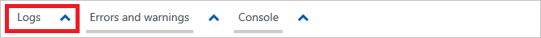

	_Opening the output log_

1. Verify that over the course of a few minutes, the log shows several outputs from Stream Analytics. (The frequency will vary because the cameras use random timers to fire events.) Note that each output contains a JSON payload containing a device ID, latitude, longitude, blob URL, and timestamp.

	> Remember that the Stream Analytics job doesn't forward every event it receives to the function. It generates an output *only* when one camera snaps two photos within 10 seconds.

	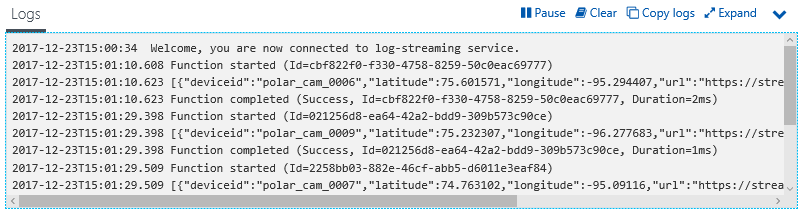

	_Monitoring calls to the Azure Function_

1. Return to the Stream Analytics job in the portal and click **Stop** to stop it. Then click **Yes** when asked to confirm that you want to stop the job.

1. Return to the Command Prompt or terminal window in which **run.js** is running and press **Ctrl+C** (**Command-C** on a Mac) to stop it, and therefore stop the flow of events from the simulated cameras.

You have confirmed that Stream Analytics is receiving input from the IoT hub and that the Azure Function is receiving input from Stream Analytics. The next step is build a machine-learning model and invoke it from the Azure Function — which is exactly what you will do in the next lab.