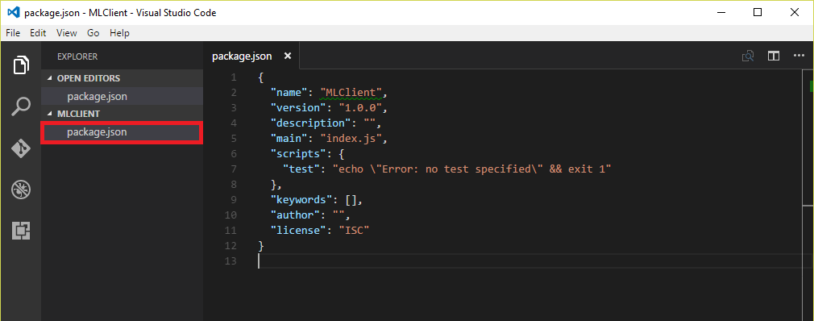
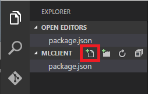

The whole reason for deploying an Azure ML model as a Web service is so you can build smart apps that utilize the model. There are a variety of ways to build such apps. You could call the service from a Web app using JavaScript and AJAX, for example, or you could use [NativeScript](https://www.nativescript.org/) to write an app that runs on iOS or Android and places calls to the service using HTTP requests.

In this exercise, you will write a cross-platform client app using [Node.js](https://nodejs.org) and [Electron](http://electron.atom.io/). The beauty of such apps is that they run on Windows, Mac, or Linux machines. The app you will write enables you to draw digits into an onscreen grid. Then it calls your ML Web service and tells you what digit you drew.

1. Create a new directory to serve as your project directory.

1. Open a terminal or Command Prompt window and navigate to the directory you created in the previous step to make it the current directory.

1. Execute the following command to verify that you have Node.js version 4 or higher installed. (If Node is installed, you will see the version number.) If Node is not installed or the version is less than 4, go to https://nodejs.org and install the latest stable version.
 
    ```
    node --version
    ```

1. Use the following command to create a new Node.js project.
 
    ```
    npm init -y
    ```

    This will create an empty **package.json** file in the current directory.

	> Node.js uses a package manager, called **npm**, to add additional components to Node.js applications. These additional components are dependencies of your application and are defined in the **package.json** file. Some dependencies are just needed when building the application, but others are required to actually run it. You will use several dependencies in your Electron application.
       
1. In the Command Prompt or terminal window, execute the following command (note the space and the period at the end of the command) to start Visual Studio Code in the current directory:

    ```
	code .
    ```

1. In Visual Studio Code, select the **Explorer** command from the **View** menu to make sure the Explorer panel is displayed. Then click **Package.json** to open the file for editing.

    

    _Opening package.json_
    
1. Add the ```dependencies``` and ```devDependencies``` properties shown below to **package.json** after the ```scripts``` property that is already there.
               
    ```json
	"dependencies": {
	  "@angular/common": "2.0.0",
	  "@angular/compiler": "2.0.0",
	  "@angular/core": "2.0.0",
	  "@angular/forms": "2.0.0",
	  "@angular/http": "2.0.0",
	  "@angular/platform-browser": "2.0.0",
	  "@angular/platform-browser-dynamic": "2.0.0",
	  "@types/core-js": "0.9.34",
	  "@types/jasmine": "2.2.34",
	  "@types/node": "6.0.41",
	  "core-js": "2.4.1",
	  "reflect-metadata": "0.1.3",
	  "rxjs": "5.0.0-beta.12",
	  "systemjs": "0.19.27",
	  "zone.js": "0.6.23"
	},
	"devDependencies": {
	  "electron": "1.8.4",
	  "npm-run-all": "3.1.0",
	  "typescript": "2.0.3"
	},
    ```

    This brings a number of important dependencies into the application. Everything under the ```dependencies``` property is associated with the [Angular](https://angular.io/) framework and related TypeScript definitions. Angular is a client framework that simplifies JavaScript applications. It provides functionality for implementing user interfaces and also for calling Web services. The ```devDependencies``` property defines other components used by the application.
     
    > You will be using [TypeScript](https://www.typescriptlang.org/) to code the application. TypeScript is a superset of JavaScript, so the code should look familiar to you. You will use some TypeScript-specific features, such as [decorators](https://www.typescriptlang.org/docs/handbook/decorators.html). (While this is not an absolute requirement, it does simplify the Angular code a bit.)
      
1. Replace the ```scripts``` property in **package.json** with the following ```scripts``` property. Then save your changes to **package.json**.
       
    ```json
	"scripts": {
	  "start": "npm-run-all --parallel electron tsc:w",
	  "electron": "electron .",
	  "tsc": "tsc",
	  "tsc:w": "tsc -w"
	},
    ```

1. Place the mouse cursor over the project directory in Visual Studio Code's Explorer panel and click the **New File** button to add a new file to the project. Name the file **tsconfig.json**.

    

    _Adding a file to the project_

1. To give TypeScript information about how to build the application, paste the following statements into **tsconfig.json**. Then save your changes.

    ```json
    {
      "compilerOptions": {
        "target": "es5",
        "module": "commonjs",
        "moduleResolution": "node",
        "sourceMap": true,
        "emitDecoratorMetadata": true,
        "experimentalDecorators": true,
        "removeComments": false,
        "noImplicitAny": false
      }
    }
    ```

1. Return to the Command Prompt or terminal window and execute the following command to install the dependencies that you defined:
 
    ```
    npm install
    ```

1. Now it is time to write the application itself. As a first step, use Visual Studio Code to create a file named **index.html** in the project directory and insert the following statements:

    ```html
    <!DOCTYPE html>
    <html lang="en">
    <head>
        <meta charset="UTF-8">
        <meta name="viewport" content="width=device-width, initial-scale=1">
        <title>DX Machine Learning Lab</title>
        <link rel="stylesheet" href="main.css">
        <script src="node_modules/core-js/client/shim.min.js"></script>
        <script src="node_modules/zone.js/dist/zone.js"></script>
        <script src="node_modules/reflect-metadata/Reflect.js"></script>
        <script src="node_modules/systemjs/dist/system.src.js"></script>
        <script src="system.config.js"></script>
        <script>
            System.import('app').catch(function(err){ console.error(err); });
        </script>
    </head>
    <body>
    <my-app>Loading ...</my-app>
    </body>
    </html>
    ```

1. Now create a file named **main.css** in the project directory and add the following style definitions:
 
    ```css
    .pixel-grid {
        -webkit-user-select: none;
        user-select: none;
        cursor: pointer;
    }
    
    .pixel-grid > div {
        margin: 0;
        padding: 0;
        display: block;
    }
    
    .pixel-grid > div > div {
        margin: 0 2px;
        padding: 0;
        display: inline-block;
        width: 30px;
        height: 30px;
        background-color: #CCCCFF;
    }
    
    .pixel-grid div.selected {
        background-color: #0000FF;
    }
    ```

1. Your app will use [System.js](https://github.com/systemjs/systemjs), a universal dynamic module loader for JavaScript, to load scripts. System.js relies on a configuration file for loading JavaScript files. Add that configuration file to the project by creating a file named **system.config.js** in the project directory and adding the following code:
   
    ```javascript
    (function (global) {
        System.config({
            paths: {
                'npm:': 'node_modules/'
            },
            map: {
                'app': '.',
                '@angular/core': 'npm:@angular/core/bundles/core.umd.js',
                '@angular/common': 'npm:@angular/common/bundles/common.umd.js',
                '@angular/compiler': 'npm:@angular/compiler/bundles/compiler.umd.js',
                '@angular/platform-browser': 'npm:@angular/platform-browser/bundles/platform-browser.umd.js',
                '@angular/platform-browser-dynamic': 'npm:@angular/platform-browser-dynamic/bundles/platform-browser-dynamic.umd.js',
                '@angular/http': 'npm:@angular/http/bundles/http.umd.js',
                '@angular/forms': 'npm:@angular/forms/bundles/forms.umd.js',
                'rxjs': 'npm:rxjs'
            },
            packages: {
                app: {
                    main: './application.js',
                    defaultExtension: 'js'
                },
                rxjs: {
                    defaultExtension: 'js'
                }
            }
        });
    })(this);
    ```

1. Electron needs a main startup file. The startup file performs the initial configuration of the application, responds to application events (such as the user closing the application), and loads the initial user interface. Create a file named **main.ts** in the project directory (the .ts extension is for TypeScript) and add the following statements to it:
 
    ```typescript
    const {app, BrowserWindow} = require('electron');
    
    let win = null;
    
    app.on('ready', () => {
        createWindow();
    });
    
    app.on('window-all-closed', () => {
        if (process.platform !== 'darwin') {
            app.quit();
        }
    });
    
    app.on('activate', () => {
        if (win === null) {
            createWindow();
        }
    });
    
    function createWindow() {
    
        win = new BrowserWindow({width: 800, height: 600});
        win.loadURL(`file://${__dirname}/index.html`);
        win.on('closed', () => {
            win = null
        });
    
        //win.webContents.openDevTools();
    }
    ```

    > You can uncomment the call to *win.webContents.openDevTools()* if you want the [Chrome Developer Tools](https://developer.chrome.com/devtools) to be opened automatically when you start the application.  This is helpful for debugging if things go wrong with your application.

1. Electron needs to know which file is the main startup file. This is specified in **package.json**. Change the ```main``` property in that file to the following:
       
    ```javascript
    "main": "main.js",
    ```

    **main.js** gets created when the TypeScript file **main.ts** gets compiled into JavaScript.     
     
1. Now comes the Angular application that displays the grid, handles mouse clicks, and calls the ML Web service you set up. Add an **application.ts** file to the project directory and add the following statements:
     
    ```typescript
    import { NgModule, Component, HostListener } from '@angular/core';
    import { BrowserModule } from '@angular/platform-browser';
    import { HttpModule, Http, Headers, RequestOptions } from '@angular/http';
    import { platformBrowserDynamic } from '@angular/platform-browser-dynamic';
    import 'rxjs/add/operator/map';
    
    const GridSize: number = 8;
    
    function forEachIndex(count: number, callback: (idx: number) => void) {
        for(let idx = 0; idx < count; idx += 1) {
            callback(idx);
        }
    }
    function mapByIndex(count: number, callback: (idx: number) => any) {
        let items = new Array(count);
        forEachIndex(count, idx => {
            items[idx] = callback(idx);
        });
        return items;
    }
    
    @Component({
        selector: 'pixel-grid',
        template: `
            <div class="pixel-grid">
                <div *ngFor="let row of rows">
                    <div *ngFor="let col of cols"
                         [ngClass]="{ selected: grid[row*gridSize+col] }"
                         (mousedown)="selectPixel(row, col, true)"
                         (mouseover)="selectPixel(row, col)">
                    </div>
                </div>
            </div>
            <div>
                <button (click)="submitGrid()">Submit</button>
                <button (click)="clearGrid()">Clear</button>
            </div>
            <div *ngIf="result">
                Azure ML says you entered a {{result}}
            </div>
            <div *ngIf="requestError"><pre>{{requestError | json}}</pre></div>
        `
    })
    class PixelGrid {
    
        isMouseButtonDown: boolean = false;
        gridSize: number = GridSize;
        grid: boolean[];
        rows: number[];
        cols: number[];
        result: string = null;
        requestError: any = null;
    
        constructor(private http: Http) {
            this.rows = new Array(GridSize);
            this.cols = new Array(GridSize);
            forEachIndex(GridSize, idx => {
                this.rows[idx] = idx;
                this.cols[idx] = idx;
            });
            this.clearGrid();
        }
    
        @HostListener('document:mousedown', [])
        onMouseDown() {
            this.isMouseButtonDown = true;
        }
    
        @HostListener('document:mouseup', [])
        onMouseUp() {
            this.isMouseButtonDown = false;
        }
    
        selectPixel(row, col, select = false) {
            if(this.isMouseButtonDown || select) {
                this.grid[row * GridSize + col] = true;
            }
        }
    
        clearGrid() {
            this.grid = new Array(GridSize * GridSize);
            forEachIndex(GridSize * GridSize, idx => {
                this.grid[idx] = false;
            });
            this.result = null;
            this.requestError = null;
        }
    
        submitGrid() {
    
            let columnNames = mapByIndex(GridSize * GridSize + 1, idx => {
                let paramIdx = "0" + (idx + 1);
                return "p" + paramIdx.substr(paramIdx.length - 2);
            });
            columnNames[GridSize * GridSize] = "digit";
    
            let values = mapByIndex(GridSize * GridSize + 1, idx => {
                return this.grid[idx] ? 16 : 0;
            });
            values[GridSize * GridSize] = 0;
    
            let request = {
                inputs: {
                    input1: {
                        columnNames,
                        values: [values]
                    }
                },
                globalParameters: {
                }
            };
            console.log('-----Request------');
            console.log(JSON.stringify(request, null, 2));
    
            this.postRequest(request);
        }
    
        postRequest(request: any) {
    
            const url = 'WEB_SERVICE_URL';
            const apiKey = 'API_KEY';
    
            let body = JSON.stringify(request);
            let headers = new Headers({
                'Content-Type': 'application/json',
                'Authorization': `Bearer ${apiKey}`
            });
            let options = new RequestOptions({
                headers: headers
            });
    
            this.result = null;
            this.requestError = null;
            this.http
                .post(url, body, options)
                .map(res => res.json())
                .subscribe({
                    next: (value) => {
                        console.log('-----Response------');
                        console.log(JSON.stringify(value, null, 2));
                        let valuesList = value.Results.output1.value.Values[0];
                        this.result = valuesList[valuesList.length - 1];
                    },
                    error: (error) => {
                        this.requestError = error.json() || error;
                    }
                });
        }
    }
    
    @Component({
        selector: 'my-app',
        template: `
            <h2>Draw a digit from 0 to 9</h2>
            <pixel-grid></pixel-grid>
        `
    })
    class AppComponent {
    }
    
    @NgModule({
        imports: [ BrowserModule, HttpModule ],
        declarations: [ AppComponent, PixelGrid ],
        bootstrap: [ AppComponent ]
    })
    class AppModule { }
    
    const platform = platformBrowserDynamic();
    platform.bootstrapModule(AppModule);
    ```
     
    The heart of the application is the ```PixelGrid``` component, which displays a two-dimensional grid in which the user draws digits and manages an array of Boolean values indicating the on/off state of each square in the grid. It also handles clicks of the **Submit** and **Clear** buttons. The **Submit** button submits the input data to the ML Web service.
    
1. The application needs the API Key and URL for your Web service. Modify **application.ts** by replacing WEB_SERVICE_URL on line 120 with the Web service URL you saved in Exercise 5, Step 7, and replacing API_KEY on line 121 with the API key you saved in Exercise 5, Step 5.

    ```typescript
    const url = 'WEB_SERVICE_URL';
    const apiKey = 'API_KEY';
    ```

1. Use Visual Studio Code's **File -> Save All** command to save all of your changes. Then return to the Command Prompt or terminal window and compile the application by executing the following command:
         
    ```
    npm run tsc
    ```

Congratulations! You built an Electron application that relies on Azure Machine Learning for intelligence. The final task is to try it out and see how intelligent the app really is.