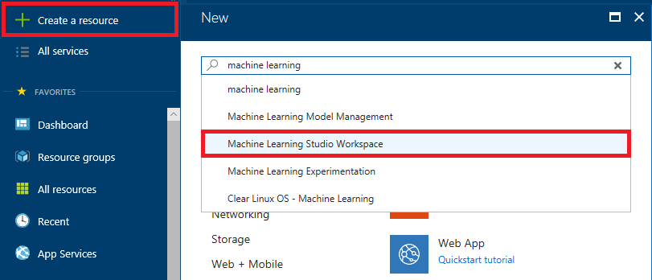
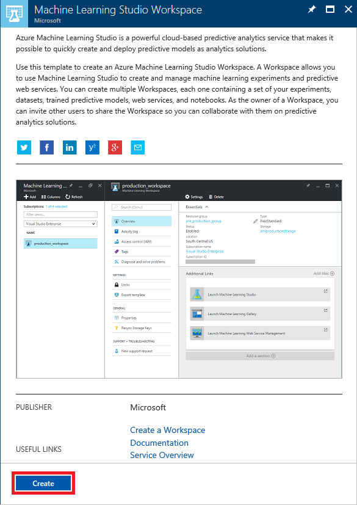
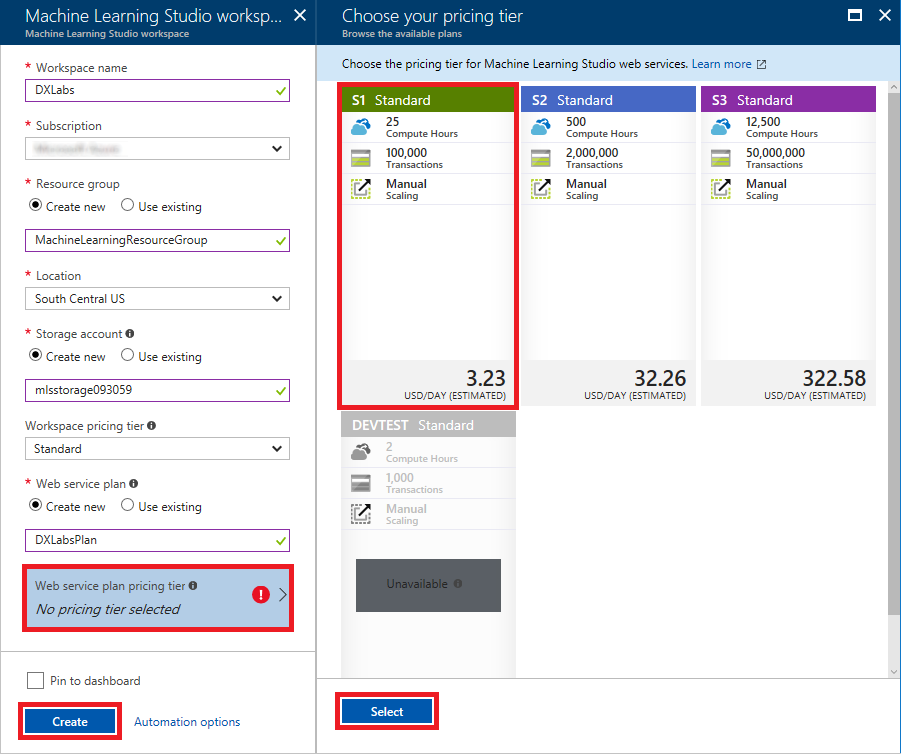
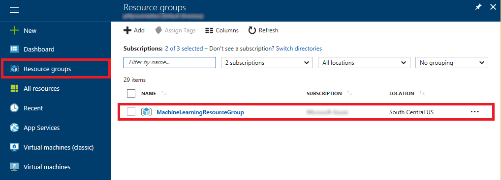
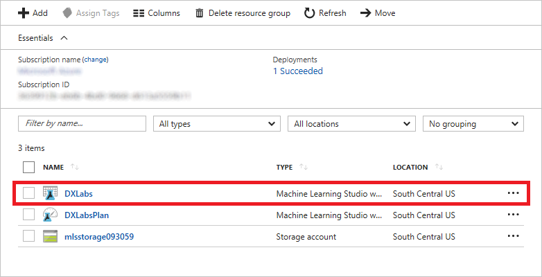
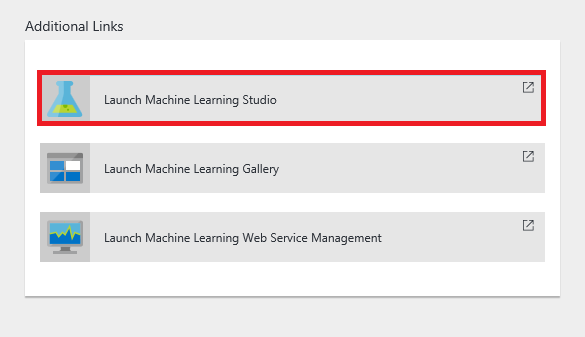
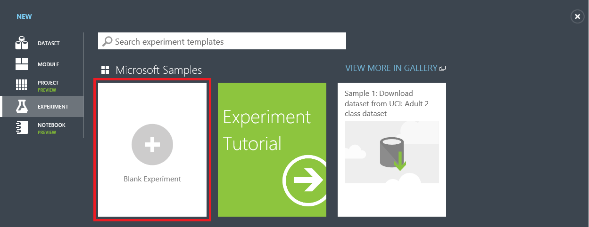
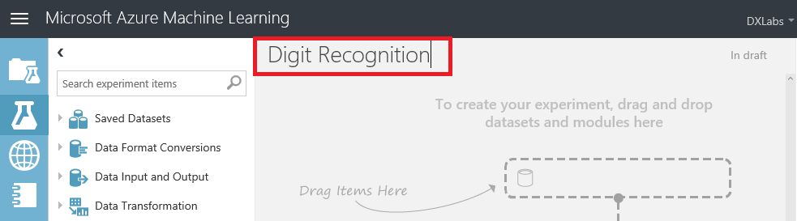

The first step in employing Azure Machine Learning Studio is to create a Machine Learning Studio workspace and an experiment to go in it. In this exercise, you'll get a machine-learning experiment up and running in Azure Machine Learning Studio.

1. Open the [Azure Portal](https://portal.azure.com) in your browser. If asked to log in, do so using your Microsoft account.

1. Click **+ Create a resource**. Then type "machine learning" (without quotation marks) into the search box and select **Machine Learning Studio Workspace** from the search results.

    

    _Creating a workspace_

1. Click the **Create** button at the bottom of the "Machine Learning Studio Workspace" blade.

    

    _Creating a workspace_

1. In the "Machine Learning Studio workspace" blade, enter a workspace name such as "AzureLabs" and make sure a green check mark appears next to it. Select **Create new** under **Resource group** and enter a resource-group name such as "MachineLearningResourceGroup." Select the location nearest you under **Location**. Then enter a storage-account name, making it as unique as possible, and make sure a green check mark appears next to it, too.

	> Storage-account names can be 3 to 24 characters in length, can only contain numbers and lowercase letters, and must be unique within Azure. A green check mark next to the name indicates that it meets all these criteria.

	Now click **Web service plan pricing tier** and select **S1 Standard** in the "Choose your pricing tier blade." Finish up by clicking **Select** at the bottom of that blade, and clicking **Create** at the bottom of the "Machine Learning Studio workspace" blade.

    

    _Creating a workspace_

1. Click **Resource groups** in the ribbon on the left side of the portal, and then click the resource group created for the Machine Learning Studio workspace.

    

    _Opening the resource group_

1. Wait until "Deploying" changes to "Succeeded," indicating that the workspace has been created. (You can click **Refresh** at the top of the blade to refresh the deployment status.) Then click the Machine Learning Studio workspace in the resource group.

    

    _Opening the workspace_

1. Click **Launch Machine Learning Studio**.

    

    _Launching ML Studio_

1. Click **Sign In** to sign in to Machine Learning Studio with your Microsoft account.

    

    _Signing in to ML Studio_

1. In Machine Learning Studio, click **+ NEW** in the lower-left corner. Then start a new experiment by clicking **Blank Experiment**.

    

    _Creating a blank experiment_

1. Click the experiment title at the top of the page ("Experiment created on...") and type a new experiment name such as "Digit Recognition."

    

    _Renaming the experiment_

Now that the experiment has been created, the next step is to import some data and build a model around it.