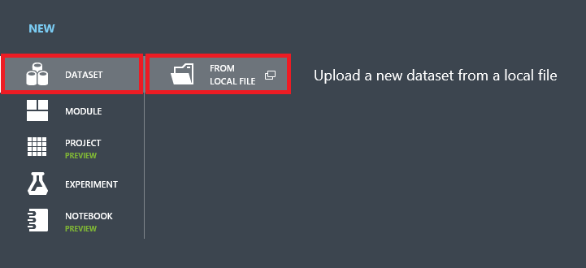
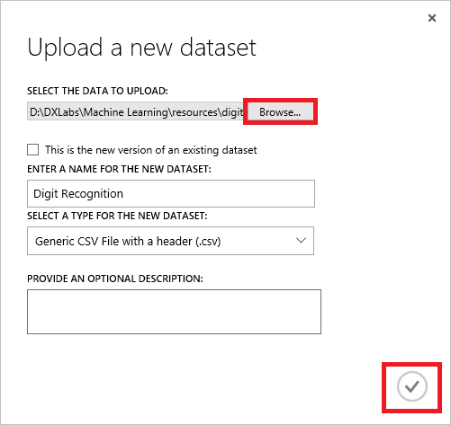
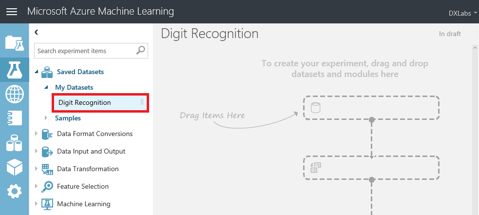
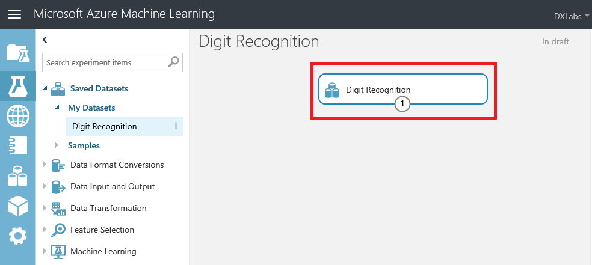
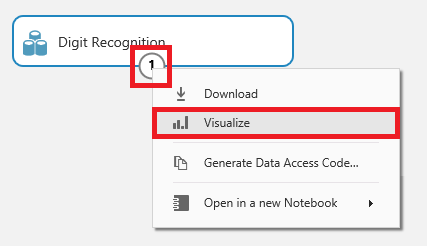
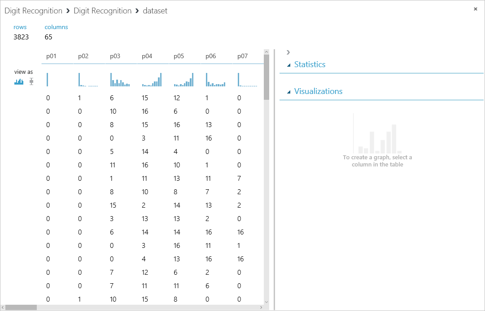
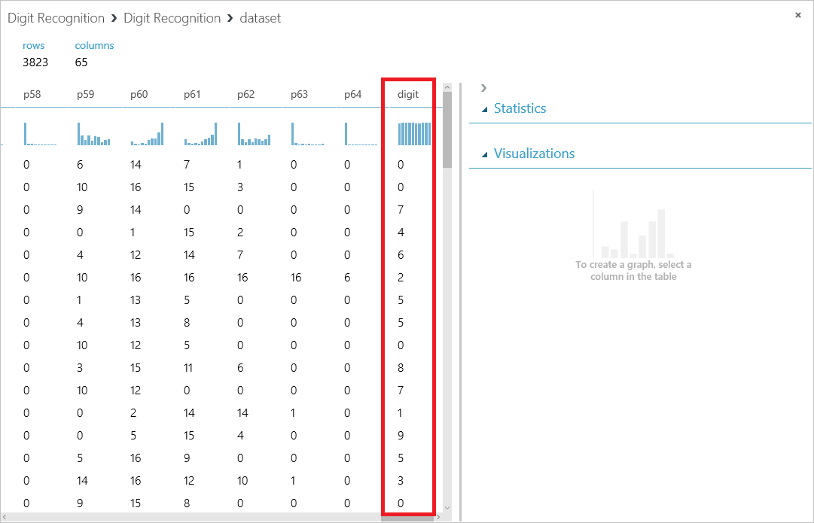

Azure Machine Learning Studio comes with several sample datasets. Additional datasets are available from a variety of sources, including [Data.gov](http://www.data.gov/), [Kaggle](http://www.kaggle.com/), and the University of California Irvine's [Machine Learning Repository](http://archive.ics.uci.edu/ml/). In this exercise, you will upload a public dataset containing data generated by scanning and digitizing handwritten digits (0 through 9) from a sample of 43 people. You will later use the dataset to train an ML model that can recognize handwritten digits with a high degree of accuracy.

1. Click **+ NEW** in the lower-left corner of ML Studio. Then click **DATASET**, followed by **FROM LOCAL FILE**.

    

    _Creating a new dataset_

1. Click the **Browse** button. Select the file named **digit-recognition.csv** from the [resources that accompany this lab](https://a4r.blob.core.windows.net/public/cs-machine-learning-resources.zip). Make sure **Generic CSV File with a header (.csv)** is selected under **SELECT A TYPE FOR THE NEW DATASET**. Optionally enter a friendly name for the dataset in the **ENTER A NAME FOR THE NEW DATASET** box, and then click the check mark in the lower-right corner to begin uploading the dataset.

    

    _Uploading the dataset_

1. Wait for the upload to finish. Then go to the modules palette on the left and find the dataset you just uploaded under **Saved Datasets** -> **My Datasets**.

    

    _The uploaded dataset_

1. Drag the dataset from the modules palette and drop it onto the canvas (the gray area to the right).

    

    _Adding the dataset to the model_

1. To see what this dataset looks like, click the output port (the circle with the "1" in it) at the bottom of the dataset and select **Visualize**.

    

    _Visualizing the dataset_

1. The variables, or "features," in the dataset appear as columns, with each row representing a digit from 0 to 9. The dataset contains 3,823 rows and 65 columns. The first 64 columns contain values from 0 to 16 representing 4x4 blocks of pixels. Each digit represented in the dataset was scanned into a 32x32 array, yielding a total of 1,024 pixels per digit. Each scan is represented in the dataset by 64 values, each representing 16 pixels. 

    

    _The Digit Recognition dataset_

1. Scroll all the way to the right until you see the final column — the one named "digit." Each value in this column is the digit that corresponds to the pixel data in the same row. THIS is the target value that your model will predict given values for the other 64 columns.

    

    _The target variable_

Close the visualization window by clicking the "**x**" in the upper-right corner. The data is loaded. Now it's time to do something with it.