In this exercise, you will use ML Studio's drag-and-drop user interface to train an ML model. *Training* involves picking a machine-learning algorithm and feeding data into the model. During training, the computer looks for patterns in the data that it can use to predict values from future inputs.

There are several types of machine-learning models. One of the most common is the regression model, which uses one of a number of regression algorithms to produce a numeric value — for example, a person's age or the probability that a credit-card transaction is fraudulent. You will be training a classification model, which seeks to resolve a set of inputs into one of a set of known outputs. A classic example of a classification model is one that examines e-mails and classifies them as "spam" or "not spam." Your model will examine a set of inputs representing pixel patterns and attempt to classify each as a digit from 0 to 9, inclusive.

1. At the top of the modules palette, type "metadata" (without quotation marks) into the search box to find the [Edit Metadata](https://msdn.microsoft.com/en-us/library/azure/dn905986.aspx) module.

    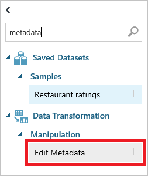

    _Finding the Edit Metadata module_

1. Drag the module to the experiment canvas and drop it underneath the dataset. Then connect the output port of the dataset to the input port of the Edit Metadata module by dragging an arrow downward from the output port. Among other things, the Edit Metadata module allows you to specify data types for the columns in the dataset.

    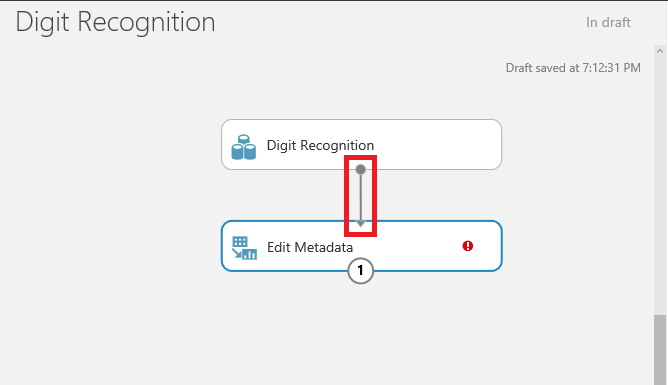

    _Adding an Edit Metadata module_

     > A key concept to understand in Azure ML Studio is that of ports and connectors. In this step, you connected the output port of the dataset to the input port of the Edit Metadata module. The data flows from one module to the next through the connector. Some modules support multiple inputs and outputs and therefore have multiple input and output ports. If you want to know what a port does, hover over it with the mouse and a tooltip will pop up. If you want more information, right-click on the module and select **Help** from the popup menu.

1. Click the Edit Metadata module to select it. (When selected, it has a bold blue border.) Then click the **Launch column selector** button in the Properties pane on the right.

    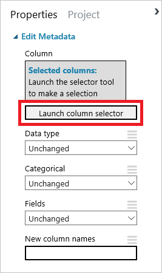

    _Launching the column selector_

1. Scroll to the bottom of the **AVAILABLE COLUMNS** list and click **digit**. Then click the **>** button to move **digit** into the **SELECTED COLUMNS** list. Recall that **digit** is the value your model will predict. Finish up by clicking the check mark in the lower-right corner of the window.

    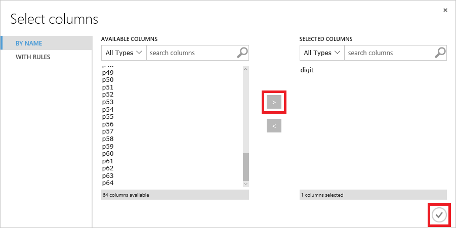

    _Selecting the digit column_

1. In the Properties pane, select **Make Categorial** from the drop-down list named **Categorical**. This tells the model that values in the **digit** column should be treated as discrete (as opposed to numeric values, which could take on values such as 7.5 and 8.6).

    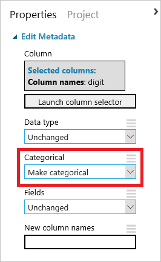

    _Making the digit column categorical_

1. Click the **SAVE** button at the bottom of the page to save the experiment.

    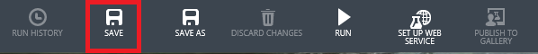

    _Saving the experiment_

	> When working with the Azure Machine Learning Studio, get in the habit of saving your experiments often, particularly before you run a model. That way, if you encounter a problem, you will not have to redo your work. Also, be aware that you **may lose your work if you click the browser's Back button without saving your experiment first.**

1. Type "split" (without quotation marks) into the search box at the top of the modules palette. Then drag a [Split Data](https://msdn.microsoft.com/en-us/library/azure/dn905969.aspx) module onto the canvas and connect the output port from the Edit Metadata module to the input port of the Split Data module. The purpose of the Split Data module is to split a dataset into two parts: one for training and one for scoring. It's useful when you don't have separate datasets for training and scoring.

    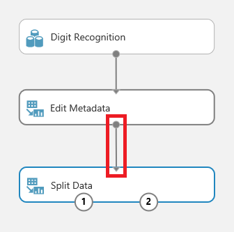

    _Adding a Split Data module_

1. Make sure the Split Data module is selected. Then go to the Properties pane on the right and set the split to 0.8. You will use 80% of the rows to train the model, and the remaining 20% to score it. Also make sure that the **Randomized split** box is checked. This is particularly important when you are splitting data that is ordered.

    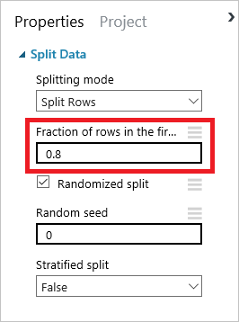

    _Setting the split percentage_

1. Click the **SAVE** button at the bottom of the page to save the experiment.

1. Click the **RUN** button at the bottom of the page to run the experiment.

1. Next, type "train model" (without quotation marks) into the search box at the top of the modules palette. Find the [Train Model](https://msdn.microsoft.com/en-us/library/azure/dn906044.aspx) module and drag it onto the canvas. Connect the left output from the Split Data module to the right input of the Train Model module.

    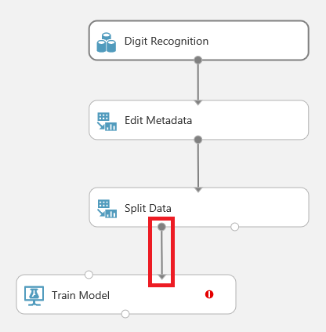

    _Adding a Train Model module_

1. The next step is a crucial one. In it, you will identify for the Train Model module which value you want it to predict. Select the Train Model module, and then click **Launch column selector** in the Properties pane.

    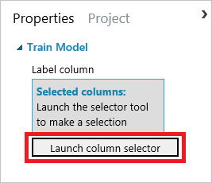

    _Launching the column selector_

1. Type in "digit" (without quotation marks) to select the **digit** column. This is the value that your model is going to predict. Finish up by clicking the check mark in the lower-right corner.

    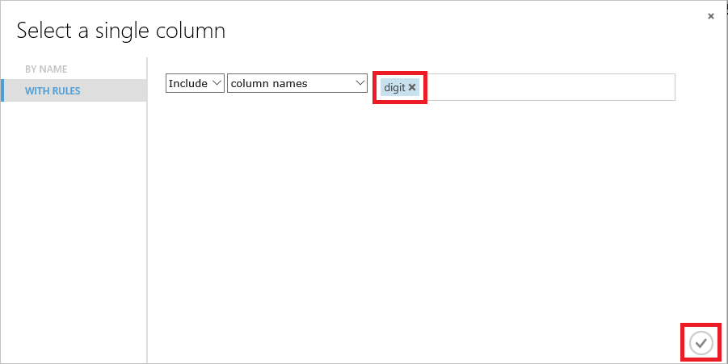

    _Specifying the target value_

1. Now it's time to select a learning algorithm. Azure Machine Learning offers several kinds of classification and regression algorithms for you to choose from, as well as algorithms of other types. Each is represented by a module in the modules palette. You can always code your own algorithms in R or Python as well. Your model will employ an algorithm known as "Multiclass Logistic Regression." It's a classification algorithm that employs logistic regression, which is frequently used in statistics to predict the probability of an outcome.

	> The Azure Machine Learning team has put together a "cheat sheet" to help you decide which algorithm to choose based on the intended purpose of your model. You can download it from [here](http://download.microsoft.com/download/A/6/1/A613E11E-8F9C-424A-B99D-65344785C288/microsoft-machine-learning-algorithm-cheat-sheet-v6.pdf).

	Type "multiclass" (without quotation marks) into the search box at the top of the modules palette. Find the [Multiclass Logistic Regression](https://msdn.microsoft.com/en-us/library/azure/dn905853.aspx) module and drag it onto the canvas. Then connect the output from the Multiclass Logistic Regression module to the left input of the Train Model module, as shown below.

    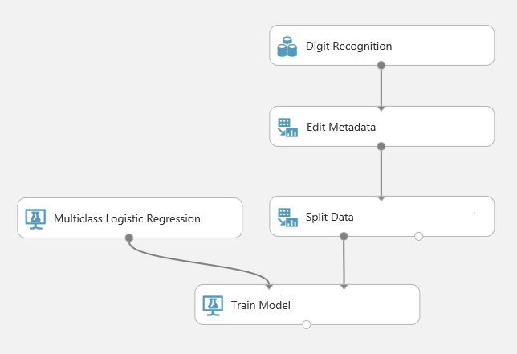

    _Specifying the learning algorithm_

1. Click the **SAVE** button to save the experiment.

1. Click the **RUN** button to run the model. Wait until green check marks appear in all the modules indicating that they ran successfully.

1. If you would like to see how influential each of the input variables was in computing an output, right-click the output port of the Train Model module and select **Visualize**. You'll see a list of all the features (columns) in the model and the weights assigned to them.

The model has been trained. But how accurate is it in predicting values? That's where scoring comes in.