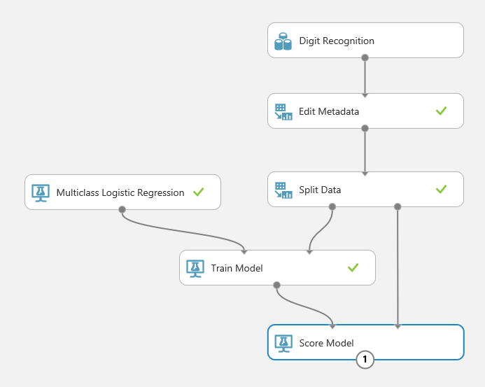
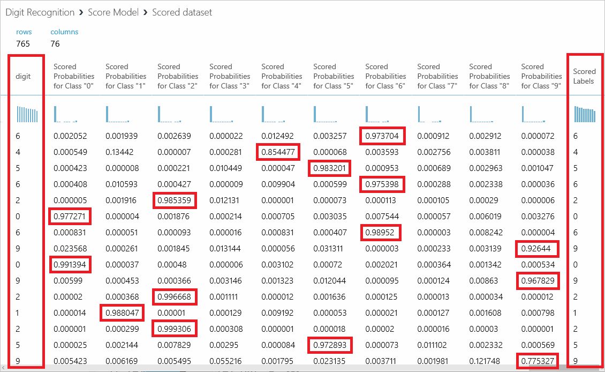
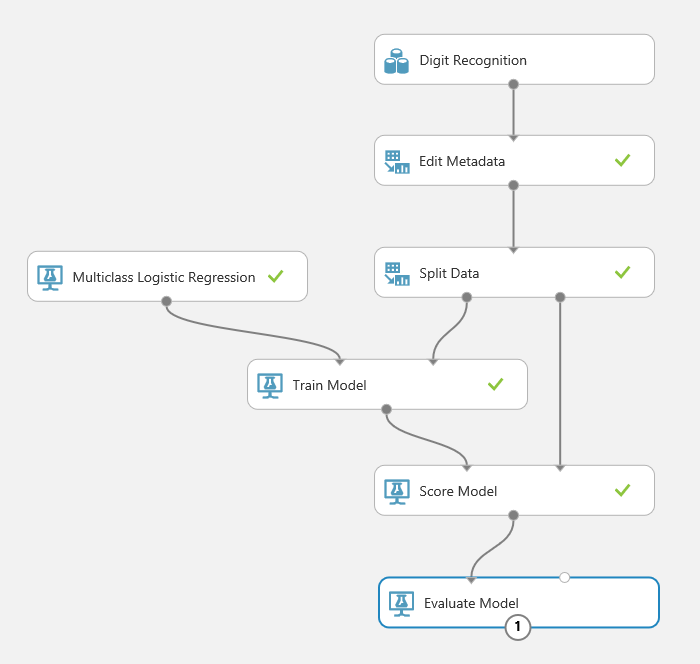
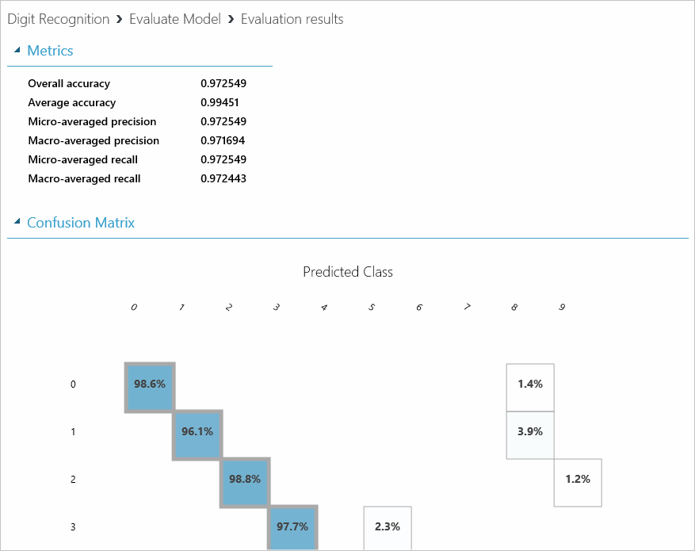

In this exercise, you will score the model you trained in the previous exercise. *Scoring* determines how well the model was trained — that is, how adept it is at predicting target values from variables presented to it. ML Studio makes the scoring process very easy. You used 80% of the dataset that you uploaded to train the model. You will use the remaining 20% to score it.

1. Add a [Score Model](https://msdn.microsoft.com/en-us/library/azure/dn905995.aspx) module to the canvas. Connect the output of the Train Model module to the Score Model module's left input port. Then connect the right output port of the Split Data module to the right input port of the Score Model module. That connection represents the 20% of the data that was not used for training.

    

    _Adding the Score Model module_

1. Click the **SAVE** button to save the experiment.

1. Click the **RUN** button to run the experiment.

1. After the run finishes, right-click the output port of the Score Model module and select **Visualize**. Scroll to the right. In the column labeled "digit," you see actual values from the 20% of the dataset passed to the Score Model module. The next ten columns — "Scored Probabilities for Class X" — indicate how the model scored the ten possible outputs (the digits 0 through 9) using the inputs on the left. The higher the number, the greater the likelihood of a match. The final column — "Scored Labels" — indicates which digit the model predicted from the inputs, which is the digit scored with the highest probability. By comparing values in the "digit" column to values under "Scored Labels," you can assess the accuracy of the model. A cursory examination reveals that the model gets it right the vast majority of the time.

    

    _The scored dataset_

1. Close the visualization window by clicking the "**x**" in the upper-right corner.

1. To evaluate the quality of the results without having to compare hundreds of values manually, add an [Evaluate Model](https://msdn.microsoft.com/en-us/library/azure/dn905915.aspx) module to the experiment canvas. Connect the output port of the Score Model module to the left input port of the output of the Evaluate Model module. (There are two input ports because Evaluate Model can be used to compare two models.)

    

    _Adding the Evaluate Model module_

1. Click **Save** to save the experiment. Then run the experiment again by clicking the **RUN** button.

1. Click the output port of the Evaluate Model module and select **Visualize** from the menu. From the **Overall accuracy** and **Average accuracy** numbers, you can see that the model performs very well. Given a digitized scan of a handwritten digit, it can correctly identify the digit more than 97% of the time.

    

    _The evaluation results_

1. Close the visualization window by clicking the "**x**" in the upper-right corner.

Now that the model is built and tested, it's time to put it to work. The ultimate goal is to write an app that runs on a PC or mobile device and calls up to the cloud and runs the model. To facilitate that, you need to deploy the model as a Web service.