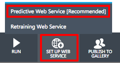
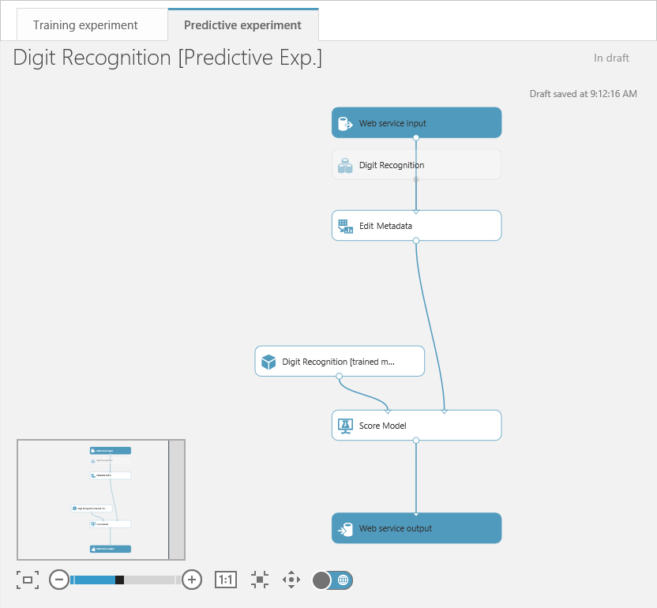
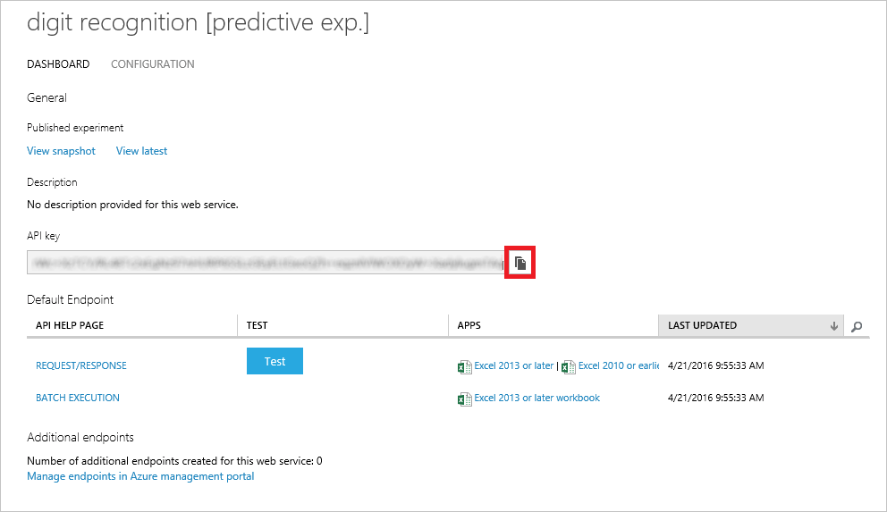
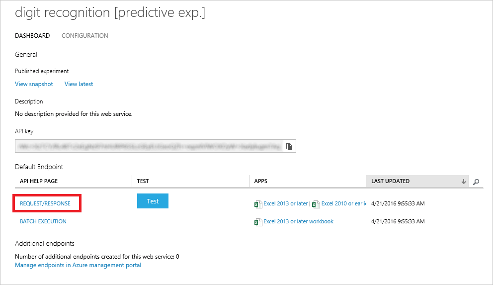
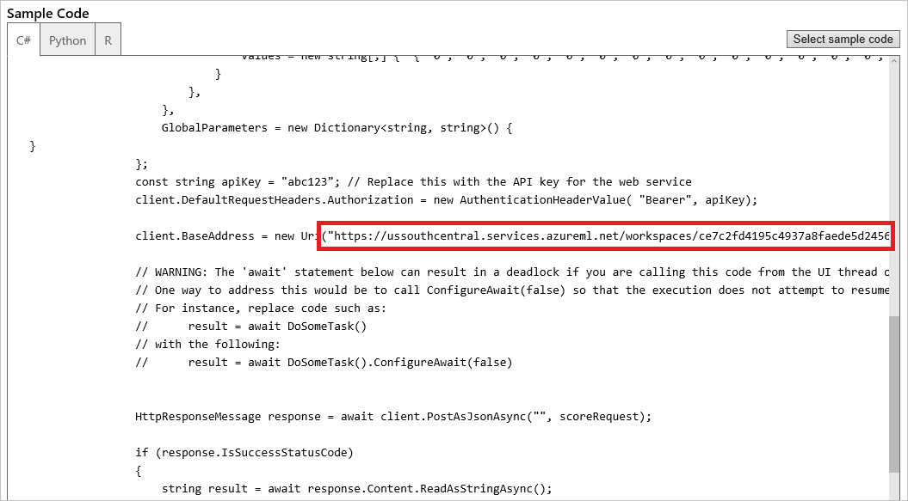

Once you have a trained and scored model, you can deploy it as a Web service and interact with it programmatically. Before deploying as a Web service, you need to streamline your experiment. This involves creating a new experiment from your trained model, removing unnecessary modules, and adding Web-service input and output modules. Fortunately, ML Studio can do all of this for you.

1. Click the **RUN** button to run your model again.

1. At the bottom of the screen, click the **SET UP WEB SERVICE** button and in the ensuing menu, select **Predictive Web Service [Recommended]**. If this option is grayed out, click the **RUN** button and try again.

    

    _Creating a predictive Web service_

1. ML Studio will spin for a few seconds, after which a predictive experiment will appear. Observe that Split Data and Train Model are gone, and that 100% of the training data now flows into Score Model. In addition, new modules were added at the top and bottom for Web-service input and output.

	> Don't be alarmed thinking your original model is gone. It's still there. You can get to it by clicking the **Training experiment** tab at the top of the page.

    

    _The predictive experiment_

1. To create a Web service that you can call to perform predictive analytics, click **RUN** once more. After the run completes, click the **DEPLOY WEB SERVICE** button to deploy the Web service.

    

    _Deploying the Web service_
 
1. In a moment, the dashboard for the new Web service will appear. The dashboard includes a **Test** button that you can click to test the Web service (not very practical here, because you'd have to enter 64 values from 0 to 16 representing pixel patterns). It also includes an API key that apps can use to make authenticated calls to the service. You will use this API key in the next exercise.

	For convenience, click the button to the right of the API key to copy the key to the clipboard, and then paste it into a text editor so you can easily retrieve it later.

    

    _Copying the API key_

1. Now click **REQUEST/RESPONSE** to see useful information about calling the Web service over HTTPS using [REST](https://en.wikipedia.org/wiki/Representational_state_transfer).

    

    _Viewing Request/Response information_

1. This page offers documentation that's useful to programmers who want to write apps that consume the Web service, including:

	- How HTTPS requests are formatted
	- How HTTPS responses are formatted
	- Input and output parameters
	- Sample code demonstrating how to call the Web service

	Scroll to the bottom of the page and you'll see the sample code. It's available in three languages: C#, Python, and R. Make sure **C#** is selected, and then scroll down until you see the statement that assigns the Web service's URL to client.BaseAddress. Copy this URL to the clipboard and paste it into a text editor so you can retrieve it in the next exercise. You're going to write code similar to this to call the Web service. And to do so, you'll need the URL.

    

    _The Web service URL_

A common question regarding Azure ML Web services is: how much do they cost? You can find the current pricing information in the [Machine Learning Pricing](https://azure.microsoft.com/en-us/pricing/details/machine-learning/) page.