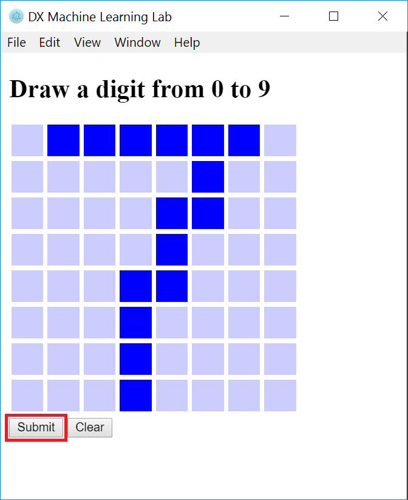
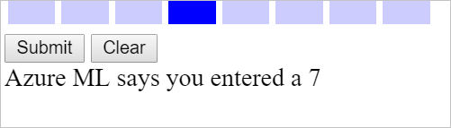

The Electron application puts a graphical front end on Web-service calls. You draw a digit into the grid of squares by dragging a mouse over the squares. Clicking the **Submit** button creates an array of 64 values (one per square, and one for each of the 64 feature columns in the training dataset), serializes it into JSON, and passes it to the Web service. The app deserializes the JSON that comes back and displays the result. In essence, the Electron client provides a highly visual way to gauge the accuracy of your ML model.

1. Run the application by executing the following command in the Command Prompt or terminal window:

    ```
    npm run electron
    ```

    > An alternative is to run the command **npm start**, which starts the application and also watches for changes in the TypeScript files, recompiling them when they change. This ensures that changes to your code will be reflected in the running application without requiring a manual restart.

1. Use your mouse to sketch a "7" into the grid, similar to the one shown below. Then click the **Submit** button.

    

    _Testing the app_

1. In a moment, a message at the bottom of the window will appear telling you what digit you sketched. Is it correct?

    

    _Azure ML's response_

1. Click the **Clear** button to clear the grid and try a few other digits. You'll probably find that the model you built is better at identifying some digits than others, and that you get the best results when the digits you draw fill the expanse of the grid as much as possible.

Any incorrect answers are partly the result of the relatively small dataset you trained the model with (the dataset was roughly 0.5 MB, which is small by big-data standards), and partly due to the fact that the onscreen grid display uses only 1/16th the resolution of the scans that the model was trained with. Nonetheless, it's a pretty impressive feat for an app to perform basic OCR in this manner. And it's indicative of the kinds of apps you can build when you have Azure Machine Learning doing the heavy lifting.