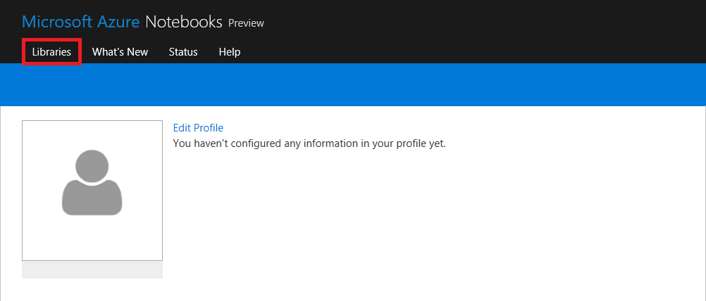
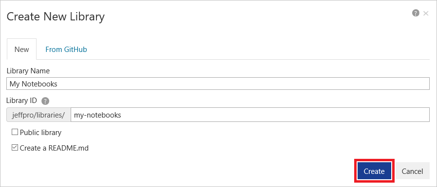
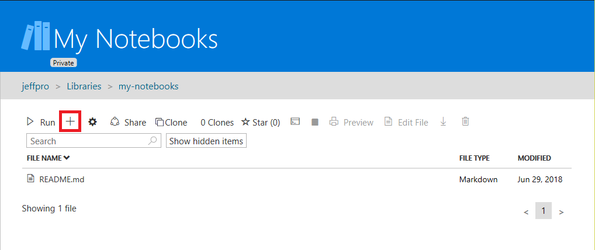
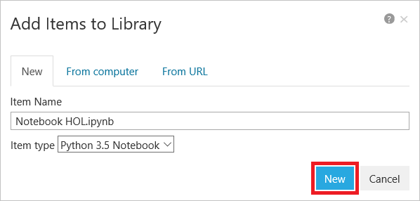
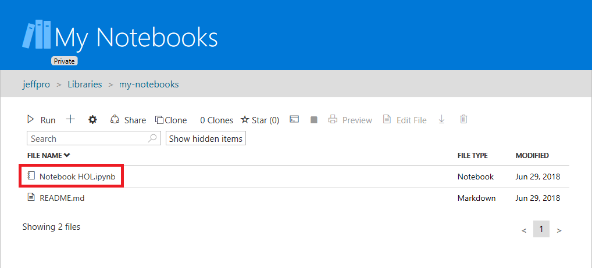

The first order of business is to create a new Azure Notebook. Azure Notebooks are contained in *libraries* whose primary purpose is to group related notebooks. In this exercise, you will create a new library and then create a notebook inside it.

1. Navigate to https://notebooks.azure.com in your browser and sign in using your Microsoft account. Then click **Libraries**.

	

	_Navigating to the Libraries page_

1. Click **+ New Library**. Enter "My Notebooks" (without quotation marks) for the library name and "my-notebooks" as the library ID. Uncheck the **Public library** box, and then click **Create**.

	

	_Creating a library_

1. Click the **+** sign to add a notebook to the library.

	

	_Adding a notebook to the library_

1. Name the notebook "Notebook HOL.ipynb" and select **Python 3.5 Notebook** as the item type. This will create a notebook with a Python 3.5 kernel. One of the strengths of Jupyter notebooks is that you can use different languages by choosing different kernels.

	

	_Creating a notebook_

	If you're curious, the .ipynb file-name extension stands for "IPython notebook." Jupyter notebooks were originally known as IPython (Interactive Python) notebooks, and they only supported Python as a programming language. The name Jupyter is a combination of Julia, Python, and R — the core programming languages that Jupyter supports.

1. Click the new notebook. This will launch the notebook and allow you to start editing it.

	

	_Opening the notebook_

You can create additional libraries and notebooks as you work with Azure Notebooks. Libraries provide a means for grouping related notebooks. You can create notebooks from scratch, or you can upload existing notebooks. In the next exercise, you will build a notebook from scratch and learn the basics of working with cells.