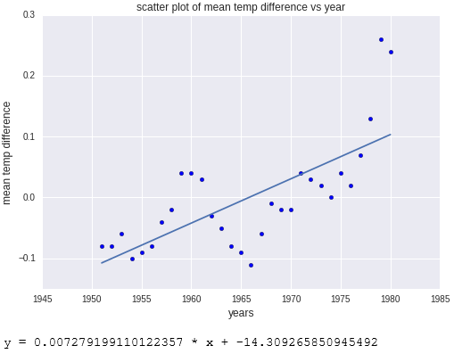

Another popular Python library that is widely used in the research community is [scikit-learn](http://scikit-learn.org/stable/), which excels at building machine-learning models to help extract information from data. In this exercise, you will use scikit-learn (which was already imported in [Exercise 2](#Exercise2)) to compute a trend line for the NASA climate data.

1. Place the cursor in the empty cell at the bottom of the notebook. Change the cell type to **Markdown** and enter "Perform linear regression with scikit-learn" as the text.

1. Add a **Code** cell and paste in the following code.

	```python
	# Pick the Linear Regression model and instantiate it
	model = LinearRegression(fit_intercept=True)

	# Fit/build the model
	model.fit(yearsBase[:, np.newaxis], meanBase)
	mean_predicted = model.predict(yearsBase[:, np.newaxis])

	# Generate a plot like the one in the previous exercise 
	plt.scatter(yearsBase, meanBase)
	plt.plot(yearsBase, mean_predicted)
	plt.title('scatter plot of mean temp difference vs year')
	plt.xlabel('years', fontsize=12)
	plt.ylabel('mean temp difference', fontsize=12)
	plt.show()

	print(' y = {0} * x + {1}'.format(model.coef_[0], model.intercept_))
	```

1. Now run the cell to display a scatter plot with a regression line.

	

	_Scatter plot with regression line computed by sckikit-learn_

The output is almost identical to the output in the previous exercise. The difference is that scikit-learn did more of the work for you. Specifically, you didn't have to code a line function as you did with NumPy; scikit-learn's ```LinearRegression``` function did it for you. scikit-learn supports *many* different types of regression, which comes in handy when building sophisticated machine-learning models.