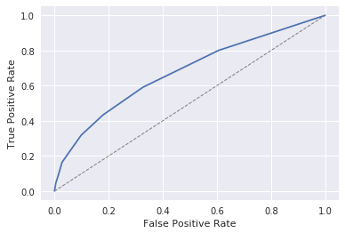
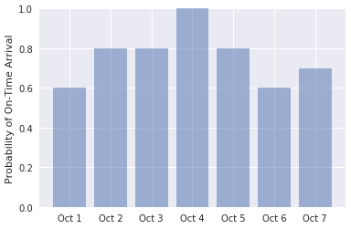
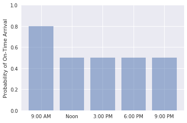

In this exercise, you will import Matplotlib into the notebook you have been working with and configure the notebook to support inline Matplotlib output.

1. Return to [Azure Notebooks](https://notebooks.azure.com) and to the notebook that you created in the first lab. If you closed the notebook after the previous lab, use the **Cell** -> **Run All** to rerun the all of the cells in the notebook after opening it.

1. Execute the following statements in a new cell at the end of the notebook. Ignore any warning messages that are displayed related to font caching:

	```python
	%matplotlib inline
	import matplotlib.pyplot as plt
	import seaborn as sns

	sns.set()
	```

	The first statement is one of several [magic commands](http://ipython.readthedocs.io/en/stable/interactive/magics.html) supported by the Python kernel that you selected when you created the notebook. It enables Jupyter to render Matplotlib output in a notebook without making repeated calls to [show](https://matplotlib.org/devdocs/api/_as_gen/matplotlib.pyplot.show.html). And it must appear before any references to Matplotlib itself. The final statement configures [Seaborn](https://seaborn.pydata.org/) to enhance the output from Matplotlib.

1. To see Matplotlib at work, execute the following code in a new cell to plot the [ROC curve](https://en.wikipedia.org/wiki/Receiver_operating_characteristic) for the machine-learning model you built in the previous lab: 

	```python
	from sklearn.metrics import roc_curve
	
	fpr, tpr, _ = roc_curve(test_y, probabilities[:, 1])
	plt.plot(fpr, tpr)
	plt.plot([0, 1], [0, 1], color='grey', lw=1, linestyle='--')
	plt.xlabel('False Positive Rate')
	plt.ylabel('True Positive Rate')
	```

1. Confirm that you see the following output:
   
   
   
   _ROC curve generated with Matplotlib_
   
The dotted line in the middle of the graph represents a 50-50 chance of obtaining a correct answer. The blue curve represents the accuracy of your model. More importantly, the fact that this chart appears at all demonstrates that you can use Matplotlib in a Jupyter notebook.

The reason you built a machine-learning model is to predict whether a flight will arrive on time or late. In this exercise, you will write a Python function that calls the machine-learning model you built in the previous lab to compute the likelihood that a flight will be on time. Then you will use the function to analyze several flights.

1. Enter the following function definition in a new cell, and then run the cell.

	```python
	def predict_delay(departure_date_time, origin, destination):
	    from datetime import datetime
	
	    try:
	        departure_date_time_parsed = datetime.strptime(departure_date_time, '%d/%m/%Y %H:%M:%S')
	    except ValueError as e:
	        return 'Error parsing date/time - {}'.format(e)
	    
	    month = departure_date_time_parsed.month
	    day = departure_date_time_parsed.day
	    day_of_week = departure_date_time_parsed.isoweekday()
	    hour = departure_date_time_parsed.hour
	    
	    origin = origin.upper()
	    destination = destination.upper()
	
	    input = [{'MONTH': month,
	              'DAY': day,
	              'DAY_OF_WEEK': day_of_week,
	              'CRS_DEP_TIME': hour,
	              'ORIGIN_ATL': 1 if origin == 'ATL' else 0,
	              'ORIGIN_DTW': 1 if origin == 'DTW' else 0,
	              'ORIGIN_JFK': 1 if origin == 'JFK' else 0,
	              'ORIGIN_MSP': 1 if origin == 'MSP' else 0,
	              'ORIGIN_SEA': 1 if origin == 'SEA' else 0,
	              'DEST_ATL': 1 if destination == 'ATL' else 0,
	              'DEST_DTW': 1 if destination == 'DTW' else 0,
	              'DEST_JFK': 1 if destination == 'JFK' else 0,
	              'DEST_MSP': 1 if destination == 'MSP' else 0,
	              'DEST_SEA': 1 if destination == 'SEA' else 0 }]
	
	    return model.predict_proba(pd.DataFrame(input))[0][0]
    ```

	This function takes as input a date and time, an origin airport code, and a destination airport code, and returns a value between 0.0 and 1.0 indicating the probability that the flight will arrive at its destination on time. It uses the machine-learning model you built in the previous lab to compute the probability. And to call the model, it passes a DataFrame containing the input values to ```predict_proba```. The structure of the DataFrame exactly matches the structure of the DataFrame depicted in Exercise 3, Step 3 of [Lab 2](../2%20-%20Process).

	Note that dates input to the ```predict_delay``` function use the international date format ```dd/mm/year```.

1. Use the code below to compute the probability that a flight from New York to Atlanta on the evening of October 1 will arrive on time. Note that the year you enter is irrelevant because it isn't used by the model.

	```python
	predict_delay('1/10/2018 21:45:00', 'JFK', 'ATL')
	```

	Confirm that the output shows that the likelihood of an on-time arrival is 60%:

	

	_Predicting whether a flight will arrive on time_

1. Modify the code to compute the probability that the same flight a day later will arrive on time:

	```python
	predict_delay('2/10/2018 21:45:00', 'JFK', 'ATL')
	```

	How likely is this flight to arrive on time? If your travel plans were flexible, would you consider postponing your trip for one day?

1. Now modify the code to compute the probability that a morning flight the same day from Atlanta to Seattle will arrive on time:

	```python
	predict_delay('2/10/2018 10:00:00', 'ATL', 'SEA')
	```

	Is this flight likely to arrive on time?

You now have an easy way to predict, with a single line of code, whether a flight is likely to be on time or late. Feel free to experiment with other dates, times, origins, and destinations. But keep in mind that the results are only meaningful for the airport codes ATL, DTW, JFK, MSP, and SEA because those are the only airport codes the model was trained with.

1. Execute the following code to plot the probability of on-time arrivals for an evening flight from JFK to ATL over a range of days:

	```python
	import numpy as np
	
	labels = ('Oct 1', 'Oct 2', 'Oct 3', 'Oct 4', 'Oct 5', 'Oct 6', 'Oct 7')
	values = (predict_delay('1/10/2018 21:45:00', 'JFK', 'ATL'),
	          predict_delay('2/10/2018 21:45:00', 'JFK', 'ATL'),
	          predict_delay('3/10/2018 21:45:00', 'JFK', 'ATL'),
	          predict_delay('4/10/2018 21:45:00', 'JFK', 'ATL'),
	          predict_delay('5/10/2018 21:45:00', 'JFK', 'ATL'),
	          predict_delay('6/10/2018 21:45:00', 'JFK', 'ATL'),
	          predict_delay('7/10/2018 21:45:00', 'JFK', 'ATL'))
	alabels = np.arange(len(labels))
	
	plt.bar(alabels, values, align='center', alpha=0.5)
	plt.xticks(alabels, labels)
	plt.ylabel('Probability of On-Time Arrival')
	plt.ylim((0.0, 1.0))
	```

1. Confirm that the output looks like this:

	

	_Probability of on-time arrivals for a range of dates_

1. Modify the code to produce a similar chart for flights leaving JFK for MSP at 1:00 p.m. on April 10 through April 16. How does the output compare to the output in the previous step?

1. On your own, write code to graph the probability that flights leaving SEA for ATL at 9:00 a.m., noon, 3:00 p.m., 6:00 p.m., and 9:00 p.m. on January 30 will arrive on time. Confirm that the output matches this:

	

	_Probability of on-time arrivals for a range of times_

If you are new to Matplotlib and would like to learn more about it, you will find an excellent tutorial at https://www.labri.fr/perso/nrougier/teaching/matplotlib/. There is *much* more to Matplotlib than what was shown here, which is one reason why it is so popular in the Python community.