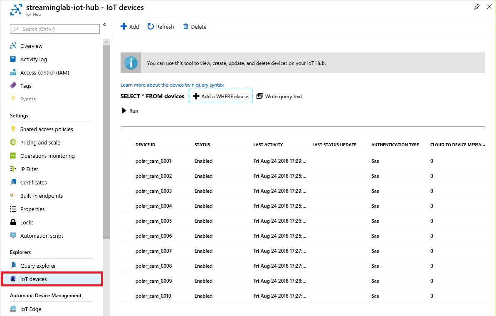
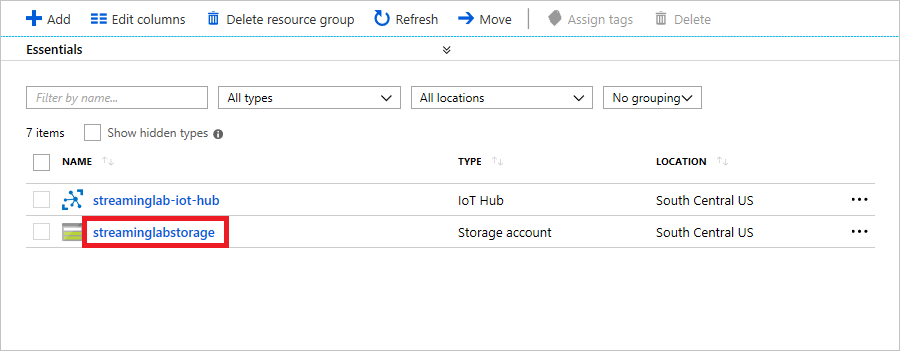
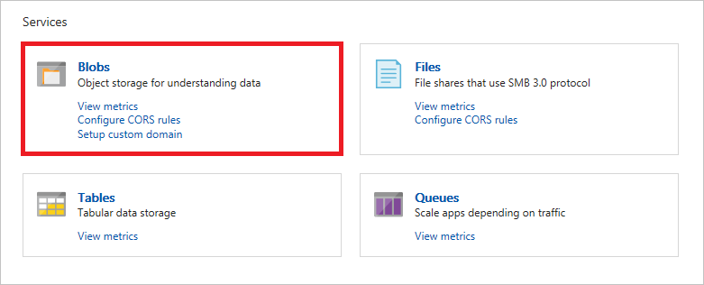
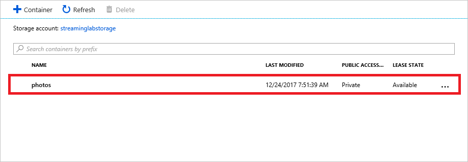
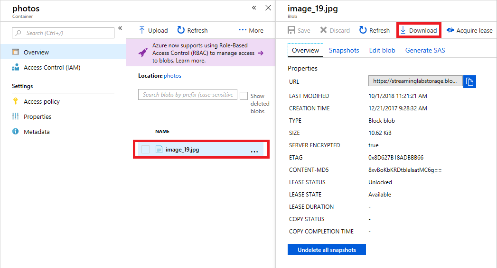

In this exercise, you will use the [Azure Cloud Shell](https://azure.microsoft.com/features/cloud-shell/) to create an Azure storage account in the cloud. The storage account will store as blobs photographs taken by the simulated cameras that you deploy. The Cloud Shell provides a browser-based command line for executing Azure commands and is an alternative to the [Azure CLI](https://docs.microsoft.com/cli/azure/?view=azure-cli-latest), which allows you to execute the same commands on your local workstation. Whether to use the CLI or the Cloud Shell is often a matter of personal preference. One of the advantages of the Cloud Shell is that it doesn't require you to install any software on your PC. Another is that you don't have to update it periodically as you do the CLI.

1. Open the [Azure Portal](https://portal.azure.com) in your browser. If asked to log in, do so using your Microsoft account.

1. Click the **Cloud Shell** button in the toolbar at the top of the portal to open the Cloud Shell.

	> If you would prefer, you can open a Cloud Shell in a separate browser window by pointing your browser to https://shell.azure.com. Clicking the Cloud Shell button in the portal opens a Cloud Shell inside the portal.

    

    _Opening the Azure Cloud Shell_

	If you haven't used the Cloud Shell before, you will prompted to choose a language. Select Bash, and if prompted to allow the Cloud Shell to create a storage account, allow it to do so. In addition, if you have multiple Azure subscriptions, you will be asked to choose a subscription. Select the one that you wish to use to create resources in this lab and the next one.

1. The next task is to create a resource group to hold the storage account and other Azure resources that comprise the solution. Make sure the language selected in the Cloud Shell is Bash, and execute the following command in the Cloud Shell to create a resource group named "streaminglab-rg" in Azure's South Central US region:

	```
	az group create --name streaminglab-rg --location southcentralus
	```

	You can use **Shift+Insert** to paste commands into the cloud shell, and **Ctrl+Insert** to copy text from the cloud shell to the clipboard.

1. Now use the following command to create a general-purpose storage account in the "streaminglab-rg" resource group. Replace ACCOUNT_NAME with the name you wish to assign the storage account.

	```
	az storage account create --name ACCOUNT_NAME --resource-group streaminglab-rg --location southcentralus --kind Storage --sku Standard_LRS
	```

	The account name must be unique within Azure, so if the command fails because the storage-account name is already in use, change the name and try again. In addition, storage-account names must be from 3 to 24 characters in length and can contain only numbers and lowercase letters.

1. Before you can upload blobs to a storage account, you must create a container to store them in. Use the following command to create a container named "photos" in the storage account, replacing ACCOUNT_NAME with the name you assigned to the storage account in the previous step:

	```
	az storage container create --name photos --account-name ACCOUNT_NAME
	```

1. Execute the following command in the Cloud Shell to list the access keys for the storage account, once more replacing ACCOUNT_NAME with the storage account's name:

	```
	az storage account keys list --account-name ACCOUNT_NAME
	```

1. Copy the primary access key from the output and paste it into a text file so you can retrieve it later. Remember that you can use **Ctrl+Insert** to copy text from the cloud shell to the clipboard.

You now have a storage account for storing photos taken by your simulated cameras, and a container to store them in. Now let's create an IoT hub to receive events transmitted by the cameras.

Azure Stream Analytics supports several types of input, including input from [Azure IoT hubs](https://azure.microsoft.com/services/iot-hub/). In the IoT world, data is easily transmitted to IoT hubs through field gateways (for devices that are not IP-capable) or cloud gateways (for devices that *are* IP-capable), and a single Azure IoT hub can handle millions of events per second from devices spread throughout the world. IoT hubs support secure two-way communications with the devices connected to them using a variety of transport protocols. In this exercise, you will create an Azure IoT hub to receive input from a simulated camera array.

1. Execute the following command in the Cloud Shell to create an IoT Hub in the same region as the storage account you created in the previous exercise and place it in the "streaminglab-rg" resource group. Replace HUB_NAME with an IoT hub name, which must be unique across Azure and conform to DNS naming conventions.

	```
	az iot hub create --name HUB_NAME --resource-group streaminglab-rg --location southcentralus --sku F1 
	```

	> The ```--sku F1``` parameter configures the IoT hub to use the free F1 pricing tier, which supports up to 8,000 events per day. However, Azure subscriptions are limited to one free IoT hub each. If the command fails because you have already created a free IoT hub, specify ```--sku S1``` instead. The S1 tier greatly expands the message-per-day limit, but is not free.

1. Use the following command to retrieve a connection string for the IoT hub, replacing HUB_NAME with the name you assigned to the IoT hub in the previous step:

	```
	az iot hub show-connection-string --name HUB_NAME
	```

1. Copy the connection-string value from the output and paste it into a text file so you can retrieve it later. That value will be of the form:

	```
	HostName=HUB_NAME.azure-devices.net;SharedAccessKeyName=iothubowner;SharedAccessKey=KEY_VALUE
	```

	Where HUB_NAME is the name of your IoT hub, and KEY_VALUE is the hub's shared access key.

The connection string that you just retrieved is important, because it will enable the app that you build in the next exercise to connect to the IoT hub securely and register an array of virtual devices.


Devices that transmit events to an Azure IoT hub must be registered with that IoT hub. Once registered, a device can send events to the IoT hub using one of several protocols, including HTTPS, [AMQP](http://docs.oasis-open.org/amqp/core/v1.0/os/amqp-core-complete-v1.0-os.pdf), and [MQTT](http://docs.oasis-open.org/mqtt/mqtt/v3.1.1/mqtt-v3.1.1.pdf). Calls are authenticated, and IoT hubs support several forms of authentication as described in [Control access to IoT hub](https://docs.microsoft.com/azure/iot-hub/iot-hub-devguide-security). In this exercise, you will create a Node.js app that registers an array of simulated cameras with the IoT hub you created in the previous exercise.

1. If Node.js isn't installed on your computer, go to https://nodejs.org/ and install it it now. You can determine whether Node is installed — and what version is installed — by opening a Command Prompt or terminal window and typing the following command:

	```
	node -v
	```

	If Node is installed, the version number will be displayed. If the version number is less than 8.0, **download and install the latest version**.

1. Create a directory on your hard disk to serve as the project directory. Then ```cd``` to that directory in a Command Prompt or terminal window.

1. Execute the following commands in sequence to initialize the project directory to host a Node project and install a trio of packages that Node can use to communicate with Azure IoT hubs:

	```
	npm init -y
	npm install azure-iothub --save
	npm install azure-iot-device azure-iot-device-mqtt --save
	```

	The [azure-iothub](https://www.npmjs.com/package/azure-iothub) package provides APIs for registering devices with IoT hubs and managing device identities, while [azure-iot-device](https://www.npmjs.com/package/azure-iot-device) and [azure-iot-device-mqtt](https://www.npmjs.com/package/azure-iot-device-mqtt) enable devices to connect to IoT hubs and transmit events using the MQTT protocol.

1. Wait for the installs to finish. Then create a file named **devices.json** in the project directory and paste in the following JSON:

	```json
	[
	    {
	        "deviceId" : "polar_cam_0001",
	        "latitude" : 75.401451,
	        "longitude" : -95.722518,
	        "key" : ""
	    },
	    {
	        "deviceId" : "polar_cam_0002",
	        "latitude" : 75.027715,
	        "longitude" : -96.041859,
	        "key" : ""
	    },
	    {
	        "deviceId" : "polar_cam_0003",
	        "latitude" : 74.996653,
	        "longitude" : -96.601780,
	        "key" : ""
	    },
	    {
	        "deviceId" : "polar_cam_0004",
	        "latitude" : 75.247701,
	        "longitude" : -96.074436,
	        "key" : ""
	    },
	    {
	        "deviceId" : "polar_cam_0005",
	        "latitude" : 75.044926,
	        "longitude" : -93.651951,
	        "key" : ""
	    },
	    {
	        "deviceId" : "polar_cam_0006",
	        "latitude" : 75.601571,
	        "longitude" : -95.294407,
	        "key" : ""
	    },
	    {
	        "deviceId" : "polar_cam_0007",
	        "latitude" : 74.763102,
	        "longitude" : -95.091160,
	        "key" : ""
	    },
	    {
	        "deviceId" : "polar_cam_0008",
	        "latitude" : 75.473988,
	        "longitude" : -94.069432,
	        "key" : ""
	    },
	    {
	        "deviceId" : "polar_cam_0009",
	        "latitude" : 75.232307,
	        "longitude" : -96.277683,
	        "key" : ""
	    },
	    {
	        "deviceId" : "polar_cam_0010",
	        "latitude" : 74.658811,
	        "longitude" : -93.783787,
	        "key" : ""
	    }
	]
	```

	This file defines ten virtual cameras that will transmit events to the IoT hub. Each "camera" contains a device ID, a latitude and a longitude specifying the camera's location, and an access key for per-device authentication. The ```key``` values are empty for now, but that will change once the cameras are registered with the IoT hub.

	> The latitudes and longitudes are for points on the coast of Northern Canada's [Cornwallis Island](https://en.wikipedia.org/wiki/Cornwallis_Island_(Nunavut)), which is one of the best sites in all of Canada to spot polar bears. It is also adjacent to [Bathurst Island](https://en.wikipedia.org/wiki/Bathurst_Island_(Nunavut)), which is home to the [Polar Bear Pass National Wildlife Area](https://www.canada.ca/en/environment-climate-change/services/national-wildlife-areas/locations/polar-bear-pass.html).

1. Add a file named **deploy.js** to the project directory and insert the following JavaScript code:

	```javascript
	var fs = require('fs');
	var iothub = require('azure-iothub');
	var registry = iothub.Registry.fromConnectionString('CONNECTION_STRING');
	
	console.log('Reading devices.json...');
	var devices = JSON.parse(fs.readFileSync('devices.json', 'utf8'));
	
	console.log('Registering devices...');
	registry.addDevices(devices, (err, info, res) => {
	    registry.list((err, info, res) => {
	        info.forEach(device => {
	            devices.find(o => o.deviceId === device.deviceId).key = device.authentication.symmetricKey.primaryKey;          
	        });
	
	        console.log('Writing cameras.json...');
	        fs.writeFileSync('cameras.json', JSON.stringify(devices, null, 4), 'utf8');
	        console.log('Done');
	    });
	});
	```

	This code registers all the simulated devices defined in **devices.json** with the IoT hub that you created earlier. It also retrieves from the IoT hub the access key created for each device and creates a new file named **cameras.json** that contains the same information as **devices.json**, but with a value assigned to each device's ```key``` property. It is this key, which is transmitted in each request, that enables a device to authenticate to the IoT hub.

1. Replace CONNECTION_STRING on line 3 of **deploy.js** with the connection string that you saved in Step 3 of the previous exercise. Then save the file.

1. Return to the Command Prompt or terminal window and execute the following command to run **deploy.js**:

	```
	node deploy.js
	```

	Confirm that the output looks like this:

	```
	Reading devices.json...
	Registering devices...
	Writing cameras.json...
	Done
	```

1. Return to the Azure Portal and open the "streaminglab-rg" resource group that you created in [Exercise 1](#Exercise1). Then open the IoT hub you added to the resource group in [Exercise 2](#Exercise2). Click **IoT devices** in the menu on the left and confirm that 10 devices named ```polar_cam_0001```, ```polar_cam_0002```, and so on are registered with the IoT hub.

    

    _Viewing device registrations_

Finish up by verifying that a file named **cameras.json** was created in the project directory Open the file and view its contents. Confirm that the ```key``` properties, which are empty strings in **devices.json**, have values in **cameras.json**.

1. Create a subdirectory named "photos" in the project directory that you created in the previous exercise. Then copy all 30 JPG files from the [resources that accompany this lab](https://topcs.blob.core.windows.net/public/400-streaming-resources-01.zip) to the "photos" directory. These are the images that the simulated cameras will upload to blob storage, samples of which are shown below. Wildlife depicted in the images include Arctic foxes, polar bears, and walruses.

	

1. In a Command Prompt or terminal window with the project directory as the current directory, execute the following command to install the [Microsoft Azure Storage SDK for Node.js](https://www.npmjs.com/package/azure-storage):

	```
	npm install azure-storage --save
	```

	This package provides a programmatic interface to Azure storage, including blob storage.

1. Add a file named **test.js** to the project directory and insert the following code:

	```javascript
	var iotHubName = 'HUB_NAME';
	var storageAccountName = 'ACCOUNT_NAME';
	var storageAccountKey = 'ACCOUNT_KEY';
	
	// Upload an image to blob storage
	var azure = require('azure-storage');
	var blobService = azure.createBlobService(storageAccountName, storageAccountKey);
	
	blobService.createBlockBlobFromLocalFile('photos', 'image_19.jpg', 'photos/image_19.jpg', (err, result, response) => {
	    if (err) {
	        console.log('Error uploading blob: ' + err);
	    }
	    else {
	        console.log("Blob uploaded");
	
	        // Get information about polar_cam_0003 from cameras.js
	        var fs = require('fs');
	        var cameras = JSON.parse(fs.readFileSync('cameras.json', 'utf8'));
	        var camera = cameras.find(o => o.deviceId === 'polar_cam_0003');
	
	        // Send an event to the IoT hub and include the blob's URL
	        var Message = require('azure-iot-device').Message;
	        var connectionString = 'HostName=' + iotHubName + '.azure-devices.net;DeviceId=' + camera.deviceId + ';SharedAccessKey=' + camera.key;
	        var clientFromConnectionString = require('azure-iot-device-mqtt').clientFromConnectionString;
	        var client = clientFromConnectionString(connectionString);
	
	        client.open(err => {
	            if (err) {
	                console.log('Error connecting to IoT hub: ' + err);
	            }
	            else {
	                var data = {
	                    'deviceId' : camera.deviceId,
	                    'latitude' : camera.latitude,
	                    'longitude' : camera.longitude,
	                    'url' : 'https://' + storageAccountName + '.blob.core.windows.net/photos/image_19.jpg',
	                    'timestamp' : new Date().toISOString()
	                };
	
	                var message = new Message(JSON.stringify(data));
	
	                client.sendEvent(message, (err, result) => {
	                    if (err) {
	                        console.log('Error sending event: ' + err);
	                    }
	                    else {
	                        console.log("Event transmitted");                
	                    }
	                });
	            }
	        });
	    }
	});
	```

	This code uploads the file named **image_19.jpg** from the current directory's "photos" subdirectory to the storage account's "photos" container. Then it opens a connection from ```polar_cam_0003``` to the IoT hub using ```polar_cam_0003```'s access key (which comes from **cameras.js**) and transmits a message containing a JSON payload over MQTT. That message includes a camera ID, a latitude and longitude, the URL of the blob that was uploaded, and the event time.

1. Replace HUB_NAME on line 1 of **test.js** with the name of the IoT hub you created in [Exercise 2](#Exercise2), and ACCOUNT_NAME on line 2 with the name of the storage account that you created in [Exercise 1](#Exercise1).

1. Return to the Azure Cloud Shell and use the following command to list the access keys for the storage account, replacing ACCOUNT_NAME with the name of your storage account:

	```
	az storage account keys list --account-name ACCOUNT_NAME --resource-group streaminglab-rg
	```

	By default, blobs stored in an Azure storage account are private and are only accessible to persons who have access to the subscription under which the account was created. Access keys allow other parties, including apps, to access the contents of a storage account. You should treat access keys with great care and **never** give them to someone you don't trust.

1. Copy the ```value``` property of either of the two keys that is displayed in the command output to the clipboard. Then replace ACCOUNT_KEY on line 3 of **test.js** with the access key. That line should now look something like this:

	```javascript
	var storageAccountKey = 'doPZd+uLueiDMY0JWtg...qWtWfmJLVkTe/huqlTliq8ruy8L1lzmDV9l6HkRw==';
	```

1. Save **test.js**, and then run it with the following command:

	```
	node test.js
	```

	Confirm that you see the following output indicating that the command completed successfully:

	```
	Blob uploaded
	Event transmitted
	```

1. Return to the Azure Portal and open the "streaminglab-rg" resource group that you created in [Exercise 1](#Exercise1). Then click the storage account.

	

	_Opening the storage account_

1. In the blade for the storage account, click **Blobs** to view a list of blob containers.

    

    _Viewing blob containers_

1. Click **photos** to open the "photos" container.

	

	_Opening the "photos" container_

1. Click the blob named **image_19.jpg**. Then click **Download** to download the blob.

	

	_Downloading the blob_

Confirm that the blob contains a small (64x64) grayscale polar-bear image. Then open the IoT hub in the portal and confirm that it received at least one message. If it did, then your code is working correctly and you are ready to move on.